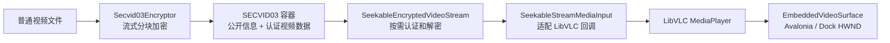

# VideoSecurityPlayer 安全视频子系统

本文档目录说明 `VideoSecurityPlayer` 中已经落地的安全视频加密与播放能力。当前实现以 SECVID03 为唯一受支持的容器格式，通过 AES-256-GCM 分块认证、可随机定位的按需解密流和 LibVLC 完成播放，并针对 Avalonia Dock 重建原生视频表面的行为实现了状态恢复。

> 这里的“安全”是指容器固定头、原视频前缀和加密视频块具有密码学完整性保护，且播放器不需要把完整视频解密到内存或临时明文文件。无需密码即可读取的标题、描述和原始文件名属于公开信息，不提供真实性保证。

## 文档导航

| 文档 | 内容 | 适合读者 |
| --- | --- | --- |
| [R1 SOLID 优化实施计划](plan-history/R1-SOLID-REFACTOR-AND-QUALITY-GATES.md) | 职责优化、状态所有权、测试门禁、中文注释与分批验收计划 | 开发者、测试人员、维护者 |
| [R1 实施与验证记录](reference/R1-IMPLEMENTATION-AND-VALIDATION.md) | 当前基线、实际验证、设计决策与阻断项 | 开发者、测试人员、维护者 |
| [实施路线图](plan-history/ROADMAP.md) | 当前基线、阶段时间线、功能依赖、退出条件和统一完成标准 | 产品、开发者、维护者 |
| [.NET 10、Avalonia 12 与 Dock 12 升级实施指南](plan-history/NET10-AVALONIA12-DOCK12-UPGRADE-GUIDE.md) | 全项目分阶段升级、中央依赖治理、播放器兼容性闸门、逐步交付物、回退和单人工期 | 开发者、测试人员、发布人员、技术负责人 |
| [G0 完成记录](plan-history/G0-BASELINE-REAL-MEDIA-LEGACY-CLEANUP.md) | 真实素材、遗留清理、SOLID 边界和 37/15 测试基线 | 开发者、维护者、评审人员 |
| [G1 安全验证](plan-history/G1-SECVID03-FORMAT-SECURITY-VALIDATION.md) | 五子域整理、威胁模型、固定向量、畸形/篡改矩阵和性能基线 | 开发者、安全评审人员 |
| [G2 可靠性闭环](plan-history/G2-ENCRYPTION-DECRYPTION-PREFLIGHT-ERROR-RESOURCE-CLOSURE.md) | 加解密预检、统一错误、不覆盖事务、取消重试和资源释放证据 | 开发者、测试人员、评审人员 |
| [G3 真实播放与 Dock 稳定性](plan-history/G3-REAL-MEDIA-PLAYBACK-DOCK-STABILITY.md) | 播放会话契约、候选 Lease、类型化错误、真实 HWND/vout 门禁和 100 次压力证据 | 开发者、测试人员、评审人员 |
| [G3.1 异步播放与 UI 响应性](plan-history/G3.1-ASYNC-PLAYBACK-UI-RESPONSIVENESS.md) | 单 MediaPlayer、原生命令串行调度、有界异步回收、内存抖动分析和 UI heartbeat 门禁 | 开发者、测试人员、评审人员 |
| [G4 P0 部署、验收与发布基线](plan-history/G4-P0-DEPLOYMENT-ACCEPTANCE-RELEASE-BASELINE.md) | 部署探针、阻断诊断、确定性发布包、大文件内存与两轮真实播放门禁 | 开发者、发布人员、评审人员 |
| [G5 批量加密与统一队列](plan-history/G5-BATCH-ENCRYPTION-UNIFIED-QUEUE.md) | 批量加密计划、严格顺序运行器、两级取消、冲突策略和 100 文件自动化证据 | 开发者、测试人员、评审人员 |
| [G6 播放器日常控制](plan-history/G6-PLAYER-DAILY-CONTROLS.md) | 全屏、倍速、快捷键、音轨/字幕、媒体库导航、连续播放和真实窗口证据 | 开发者、测试人员、评审人员 |
| [G7 媒体库与播放历史](plan-history/G7-MEDIA-LIBRARY-INCREMENTAL-HISTORY.md) | 递归扫描、目录监听、千项投影、设置/历史、隐私边界和原子恢复 | 开发者、测试人员、评审人员 |
| [G7.1 UI 职责拆分](plan-history/G7.1-UI-RESPONSIBILITY-REFACTOR.md) | 顶层兼容外壳、五个功能子包、子 View、全屏呈现器和状态所有权 | 开发者、维护者、评审人员 |
| [G9 平台与原生表面抽象](plan-history/G9-PLATFORM-NATIVE-SURFACE-ABSTRACTION.md) | 平台能力、私有运行时布局、部署初始化边界和无 HWND 的表面契约 | 开发者、测试人员、维护者 |
| [G10 性能基线与脱敏诊断](plan-history/G10-PERFORMANCE-REDACTED-DIAGNOSTICS.md) | 加解密/Seek/媒体库基线、真实播放器资源趋势、诊断 schema v1 和敏感扫描 | 开发者、测试人员、维护者、安全评审人员 |
| [G11 最终验收与完整测试手册](reference/G11-FINAL-ACCEPTANCE-AND-TEST-GUIDE.md) | 环境准备、全部命令、自动/人工矩阵、脱敏证据和最终签字 | 开发者、测试人员、发布人员、验收人员 |
| [概要设计](design/architecture-design.md) | 分层、组件职责、加密与播放数据流、DI 和 Document 生命周期 | 开发者、维护者 |
| [SECVID03 文件格式](reference/secvid03-format.md) | 二进制布局、密钥派生、GCM 认证、随机读取、公开信息和兼容策略 | 格式维护者、安全评审人员 |
| [接入、约定与排障](troubleshooting/integration-and-conventions.md) | LibVLC 部署、插件扫描、Dock 黑屏恢复、资源释放、已踩过的坑和回归检查 | 集成人员、问题排查人员 |
| [真实媒体测试资产](reference/real-media-test-assets.md) | 合成 MP4/WebM 的来源、授权、生成、完整性和阶段边界 | 开发者、测试人员 |

## 系统边界

该子系统包含四项宿主菜单能力：

- **批量视频加密器**：一次添加多个普通视频，通过两阶段预检和确认严格顺序写为 `.secvid`；正式提交不覆盖，单项失败或取消不阻断后续项目。
- **批量视频解密器**：重新预检未成功项，顺序导出多个 SECVID03 文件，隔离单项失败，净化输出名称且不静默覆盖已有文件。
- **加密视频播放器**：无需密码读取公开标题和描述；输入密码后验证固定头，并把 SECVID03 暴露为可随机读取的原视频视图供 LibVLC 解码。
- **加密视频库播放器**：异步扫描当前目录或递归子目录，监听文件变化，支持搜索、排序、状态筛选和播放历史，并用当前 Document 的公共密码在同一页面切换播放。

此外，插件从 `3.1.0` 起声明一个无 UI Workflow Action：`encrypt-video` 复用相同的单文件应用服务，
成功生成新 SECVID03 文件并始终保留源文件。它不提供删除源文件开关，密码只从 Workflow Studio 的
当前会话 Secret 进入一次调用。

核心链路如下：

加密、解密和播放器共用 SECVID03 格式定义，但不共享密码、任务状态、播放位置或原生播放器实例。每个 Dock Document 都有独立 DI Scope；平台状态、运行时布局和部署探针是进程级事实源，`LibVlcRuntime` 只在检查通过后执行一次 `Core.Initialize`。ViewModel 和播放会话不暴露 HWND 或 `MediaPlayer`；只有 Windows `EmbeddedVideoSurface` 负责两者绑定。加解密共用预检严重级别、稳定失败代码、不覆盖输出事务和顺序队列语义，但仍保持独立应用服务。

## 运行基线

| 项目 | 当前基线 |
| --- | --- |
| .NET | .NET 10 (`net10.0`) |
| 操作系统和架构 | Windows x64 |
| LibVLCSharp | 3.10.0 |
| LibVLCSharp.Avalonia | 3.10.0 |
| VideoLAN.LibVLC.Windows | 3.0.23.1 |
| 容器格式 | SECVID03 |
| 插件部署目录 | `Controls/VideoSecurityPlayer/` |
| 原生运行时相对目录 | `native/win-x64/libvlc/` |

运行时不会回退到宿主输出根目录、`PATH` 或系统安装的 VLC。私有原生目录不完整时，播放器会报告实际检查的绝对路径。

## 快速部署与发布

当前正式包为 `Controls/VideoSecurityPlayer/`。构建、部署、覆盖率与真实 Host 验收命令见[部署和验收指南](../deployment-and-release.md)。原历史脚本入口已退役；阶段记录保留当时事实。

两个播放文档打开时都会先执行只读部署自检。失败不会阻止文档创建，也不会初始化 LibVLC；页面会显示问题码、实际路径、建议动作和“重新检测”，并仅禁用依赖 LibVLC 的命令。部署完整时，为保持 Avalonia `VideoView`、HWND 与 vout 的已验证绑定顺序，Document backend 在首次视图绑定前创建，后续媒体切换始终复用同一 PlayerHost。

## 快速使用

### 批量创建加密视频

1. 在宿主中打开“视频文件加密器”，一次选择一个或多个普通视频。
2. 每项默认输出到源文件旁的 `<原名>_encrypted.secvid`；可逐项修改输出、公开标题和公开描述。
3. 选择严格阻止或安全数字后缀策略，输入并确认至少 6 个字符的公共密码。
4. 点击“检查批次”，确认可执行、冲突、警告和阻止数量。
5. 点击“开始执行”。任务严格顺序运行；可取消当前后继续，也可取消全部。

批次检查会验证输入、同路径、公开信息、批次内/磁盘重名、目录写入和按卷累计空间。编辑输出或公开信息会使旧计划失效，必须重新检查。成功项在重试时自动跳过；失败/取消项可以逐项或批量重试。

加密过程使用与目标文件相同目录中的唯一 `.partial-*` 临时文件。只有全部分块写入、落盘刷新和关闭成功后，临时文件才会以不覆盖方式移动为目标文件；关闭文档、取消、磁盘错误或其他异常都会进入临时文件清理路径。

### 播放加密视频

1. 在宿主中打开“加密视频播放器”。
2. 选择 `.secvid` 文件。播放器会先显示无需密码的公开标题和描述。
3. 输入密码并加载。加载阶段执行 PBKDF2、固定头认证和 15 秒受限 LibVLC 回调媒体解析；LibVLC 3.0.23 返回干净 `Skipped` 时由后续真实播放、轨道和 Seek 门禁继续判定，不会完整解密视频。
4. 使用播放、暂停、停止、进度、音量、六档倍速、音轨和字幕控件；全屏覆盖宿主内容区并保留标题栏。
5. 播放器获得焦点后可用 `Space`、左右方向键和上下方向键控制播放、5 秒 Seek 与 5% 音量；全屏时按 `Esc` 退出。文本输入、下拉框、滑块、列表和按钮焦点不会被这些快捷键抢占。

切换 Dock 标签页或进出全屏后，播放器会在新视频表面恢复原位置、播放/暂停、倍速和仍然存在的轨道选择。

### 浏览文件夹视频库

1. 在宿主中打开“加密视频库播放器”，选择包含 `.secvid` 的文件夹。
2. 默认只扫描当前目录；“库设置”默认折叠并记住上次展开状态，其中可启用递归子目录、选择或刷新目录，以及调整排序、筛选、公共密码和历史。折叠摘要只显示目录、排序和“密码已输入/未输入”，不会回显密码。
3. 搜索框始终可见，匹配磁盘文件名、公开标题和公开描述；清除搜索只重建当前列表投影，不会重新扫描磁盘。列表占据侧栏的主要高度，目录新增、删除、修改和改名仍会自动合并刷新。
4. 输入当前视频库共用的密码。点击“加载所选视频”会恢复历史位置并保持暂停；双击列表项或按 `Enter` 则会恢复未完成的历史位置并立即播放。已看完、无历史或文件身份已变化时从头播放。
5. 上一项/下一项按当前筛选列表顺序导航；连续播放默认关闭，只在自然播放结束后前进一项，到列表末尾停止且不循环。

公开信息损坏的文件仍会以磁盘文件名显示并标注错误。此类文件仍可尝试播放，因为公开区损坏不必然意味着受认证保护的视频主体损坏。

最近目录、递归、排序、筛选、侧栏、音量、倍速和最多 1,000 条播放历史保存在当前用户
LocalAppData。路径与位置是明文隐私数据；密码、密钥、公开描述和轨道不落盘。侧栏提供清除
单项和二次确认清空全部历史。

### 批量解密视频

1. 在宿主中打开“批量视频解密器”，一次选择多个 `.secvid` 文件。
2. 选择统一输出目录并输入这些文件共用的密码。
3. 开始解密。任务严格顺序执行，一个文件失败不会阻止后续文件；失败或取消项可在修正密码后重试，已经成功的项目会被跳过。
4. 输出名称来自经过净化的公开原始文件名，扩展名来自固定头；已有同名文件时自动追加编号，任何情况下都不会静默覆盖。

单文件导出先验证固定头和密码，随后以固定大小缓冲区逐块认证解密。明文先写入唯一 `.partial-*`，完整刷新后才以不覆盖模式提交；取消、内容篡改或磁盘错误会删除当前半成品，而此前已经成功的文件保持不变。密码只存在于当前 Document 和调用链中，不写入队列模型、公开信息或日志。

### 编辑公开信息

标题和描述位于固定的 64 KiB 公开区，可以在不移动或重新加密视频主体的情况下原地修改。进入编辑前，播放器会释放当前 `Media` 和 `MediaInput`，避免 LibVLC 后台读取与文件写入冲突。修改后需要重新输入密码加载媒体。

## 当前限制

- 仅支持 Windows x64；项目和原生运行时都固定为 x64。
- 播放器只接受结构和认证均有效的 SECVID03；其他格式或损坏容器会被受控拒绝。
- 文件夹视频库支持递归和目录监听，但密码、连续播放、音轨和字幕仍不持久化；连续播放默认关闭，按当前筛选列表前进且不循环。
- 批量加密和解密只支持显式多选文件，不持久化队列或公共密码；关闭 Document 会取消当前工作并放弃等待项。
- 密码丢失后无法从容器恢复；公开区也不保存可直接比较的明文 key hash。
- 标题最多 200 个 Unicode Rune，描述最多 10,000 个 Unicode Rune，同时还受 UTF-8 字节上限约束。
- 公开信息使用 CRC32 检测意外损坏，不用于防篡改；拥有文件写权限的人可以重写公开信息和 CRC。
- `SeekableEncryptedVideoStream` 本身不保证多线程并发安全；LibVLC 适配器在回调入口串行化访问。
- 真实播放集成门禁只支持交互式 Windows x64 会话；Headless 后端不能验证 HWND 和 vout。

## 源码入口

- 插件与服务注册：[VideoSecurityPlayerPluginModule.cs](../../src/VideoSecurityPlayer.Plugin/Plugin/VideoSecurityPlayerPluginModule.cs)
- 非破坏性 Workflow Action：[EncryptVideoWorkflowAction.cs](../../src/VideoSecurityPlayer.Plugin/Business/SecretVideoPlayer/Workflow/EncryptVideoWorkflowAction.cs)、[G4 实施记录](../plan-history/workflow-action/g4-my-small-tools-nondestructive-encryption-action.md)
- 加密与格式：[Secvid03Encryptor.cs](../../src/VideoSecurityPlayer.Plugin/Business/SecretVideoPlayer/Encryption/Secvid03Encryptor.cs)、[Secvid03Format.cs](../../src/VideoSecurityPlayer.Plugin/Business/SecretVideoPlayer/Container/Secvid03Format.cs)
- 随机读取播放：[SeekableEncryptedVideoStream.cs](../../src/VideoSecurityPlayer.Plugin/Business/SecretVideoPlayer/Container/SeekableEncryptedVideoStream.cs)、[SecureVideoPlayer.cs](../../src/VideoSecurityPlayer.Plugin/Business/SecretVideoPlayer/Playback/SecureVideoPlayer.cs)、[PlaybackMediaLease.cs](../../src/VideoSecurityPlayer.Plugin/Business/SecretVideoPlayer/Playback/PlaybackMediaLease.cs)、[PlaybackNativeDispatcher.cs](../../src/VideoSecurityPlayer.Plugin/Business/SecretVideoPlayer/Playback/PlaybackNativeDispatcher.cs)、[PlaybackResourceReaper.cs](../../src/VideoSecurityPlayer.Plugin/Business/SecretVideoPlayer/Playback/PlaybackResourceReaper.cs)
- 批量明文导出：[Secvid03Decryptor.cs](../../src/VideoSecurityPlayer.Plugin/Business/SecretVideoPlayer/Decryption/Secvid03Decryptor.cs)、[VideoDecryptionService.cs](../../src/VideoSecurityPlayer.Plugin/Business/SecretVideoPlayer/Decryption/VideoDecryptionService.cs)
- 平台与 Dock 视频表面：[PlaybackPlatform.cs](../../src/VideoSecurityPlayer.Plugin/Business/SecretVideoPlayer/Playback/PlaybackPlatform.cs)、[EmbeddedVideoSurface.cs](../../src/VideoSecurityPlayer.Plugin/Views/SecretVideoPlayer/EmbeddedVideoSurface.cs)、[PlaybackSurfaceCoordinator.cs](../../src/VideoSecurityPlayer.Plugin/Views/SecretVideoPlayer/Playback/PlaybackSurfaceCoordinator.cs)
- 文件夹视频库：[VideoLibraryScanner.cs](../../src/VideoSecurityPlayer.Plugin/Business/SecretVideoPlayer/Library/VideoLibraryScanner.cs)、[SecretVideoLibraryViewModel.cs](../../src/VideoSecurityPlayer.Plugin/ViewModels/SecretVideoPlayer/SecretVideoLibraryViewModel.cs)
- 自动化测试：[Secvid03Tests.cs](../../tests/VideoSecurityPlayer.Tests/Secvid03Tests.cs)、[Secvid03SecurityTests.cs](../../tests/VideoSecurityPlayer.Tests/Secvid03SecurityTests.cs)、[G2ReliabilityTests.cs](../../tests/VideoSecurityPlayer.Tests/G2ReliabilityTests.cs)、[G4WorkflowActionTests.cs](../../tests/VideoSecurityPlayer.Tests/G4WorkflowActionTests.cs)、[G5BatchQueueTests.cs](../../tests/VideoSecurityPlayer.Tests/G5BatchQueueTests.cs)、[G8P1IntegrationAcceptanceTests.cs](../../tests/VideoSecurityPlayer.Tests/G8P1IntegrationAcceptanceTests.cs)、[G9PlatformAbstractionTests.cs](../../tests/VideoSecurityPlayer.Tests/G9PlatformAbstractionTests.cs)
- 真实窗口门禁：[VideoSecurityPlayer.Playback.IntegrationHarness](../../tools/VideoSecurityPlayer.Playback.IntegrationHarness)
- 发布门禁：[VideoSecurityPlayer.ReleaseAcceptance](../../tools/VideoSecurityPlayer.ReleaseAcceptance)、Release-VideoSecurityPlayerP0.ps1（历史引用：`../../../../../scripts/Release-VideoSecurityPlayerP0.ps1`）
- P1 集成验收：[G8-P1-INTEGRATION-ACCEPTANCE.md](plan-history/G8-P1-INTEGRATION-ACCEPTANCE.md)、Accept-VideoSecurityPlayerP1.ps1（历史引用：`../../../../../scripts/Accept-VideoSecurityPlayerP1.ps1`）

本文档描述当前实现，不把设想中的跨平台支持、旧格式兼容或其他加密算法写作已有能力。格式或接入行为变化时，应同时更新本目录文档和对应自动化测试。
