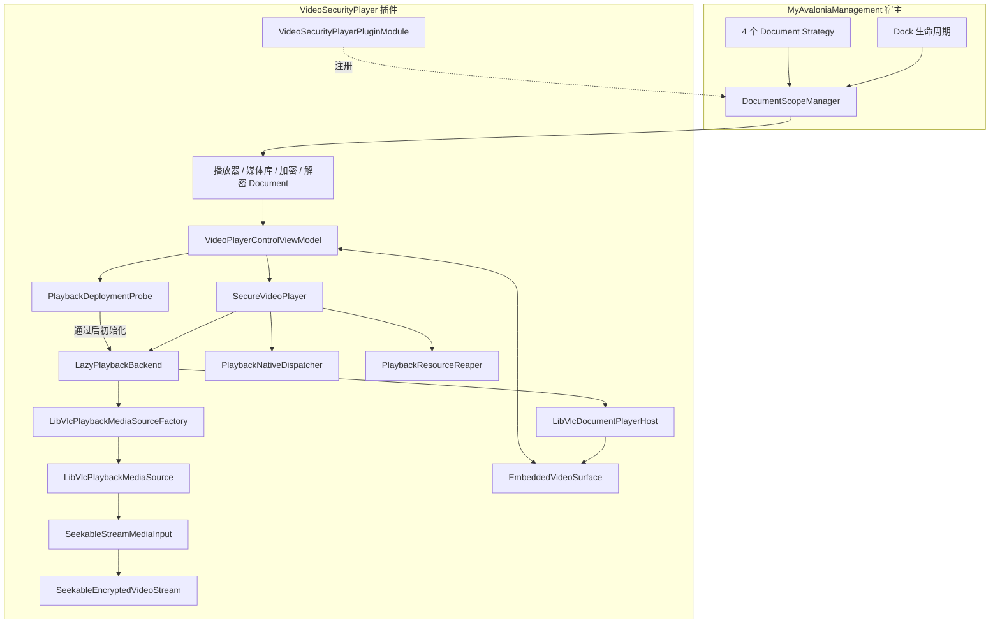
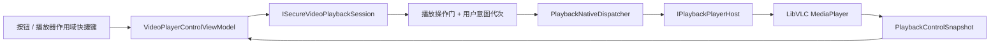
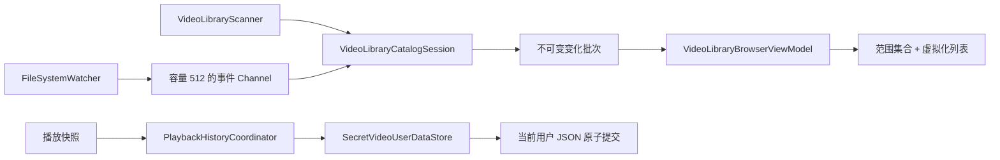
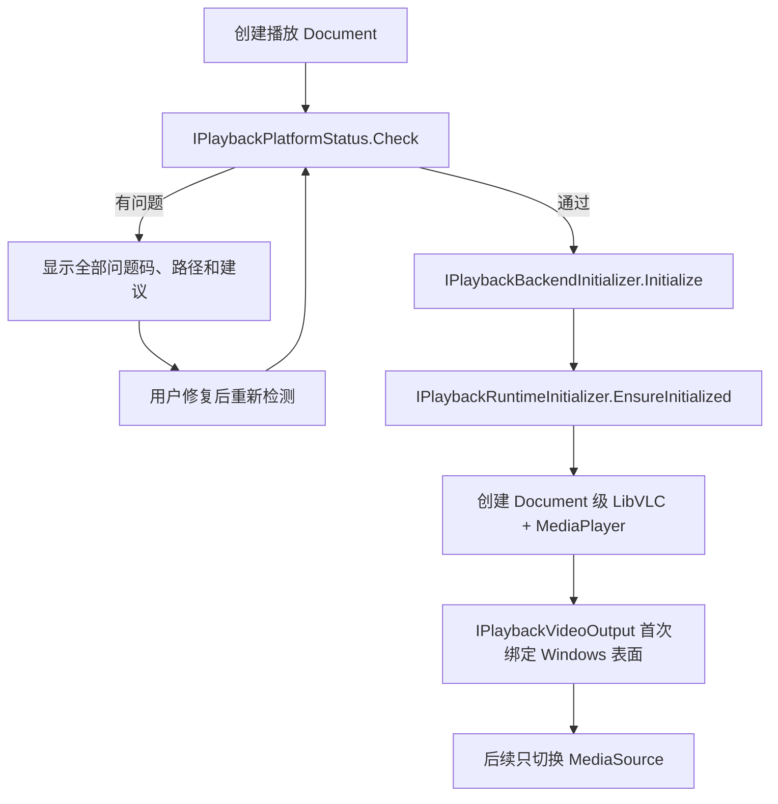
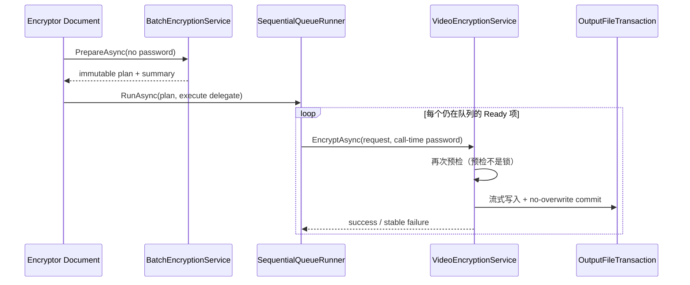
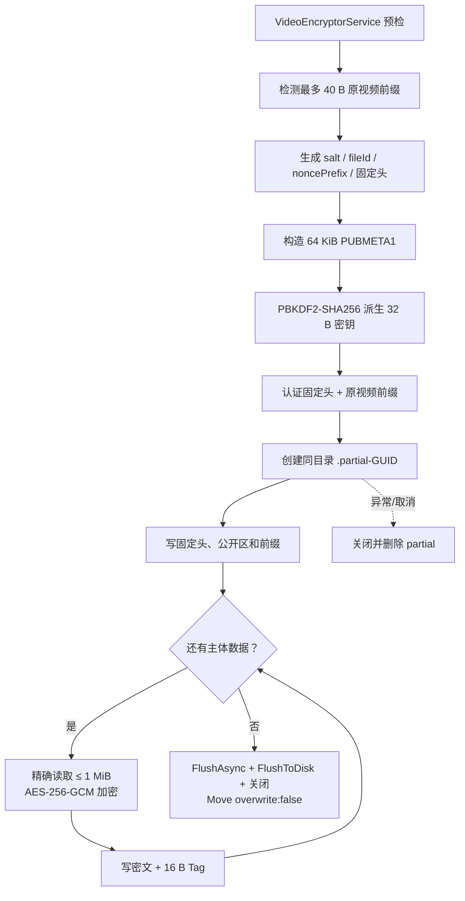
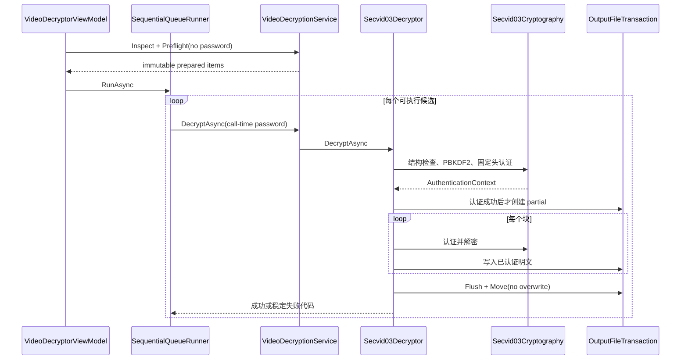
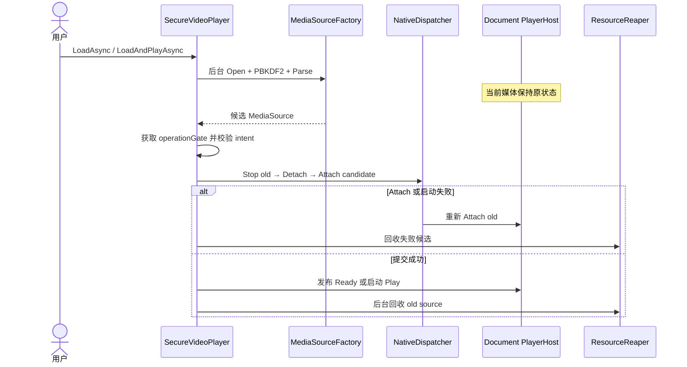
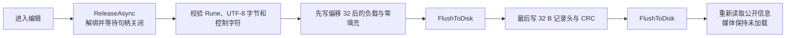

# 安全视频子系统架构设计

## 1. 适用基线

本文描述 `VideoSecurityPlayer` 当前安全视频实现，不描述历史原型。

| 项目 | 当前基线 |
| --- | --- |
| 目标框架 | `.NET 10`（`net10.0`） |
| 容器格式 | `SECVID03`，格式版本 3 |
| 播放桥接 | `LibVLCSharp 3.10.0`、`LibVLCSharp.Avalonia 3.10.0` |
| 原生运行时 | `VideoLAN.LibVLC.Windows 3.0.23.1` |
| 支持平台 | Windows x64 |
| 插件运行目录 | `Controls/SmallTools/` |

SECVID03 的磁盘布局已经冻结。G3.1 的异步播放改造和 G4 的部署、发布门禁没有改变容器偏移、密码学参数或公开区格式。

## 2. 设计目标与边界

当前实现保证：

- 大文件加密、解密和播放采用流式或按块处理，内存不随视频总长度线性增长。
- 密码错误、不可变头篡改、原视频前缀篡改和已读取视频块篡改会被拒绝。
- LibVLC 可以通过只读可定位流执行顺序读取和随机 Seek，不生成完整明文副本。
- 公开标题、描述和原始文件名可在输入密码前读取；标题和描述可在固定 64 KiB 区域内原地更新。
- 每个 Dock Document 拥有独立播放状态、原生播放器、恢复快照、任务取消源和资源回收队列。
- 媒体切换复用同一个 Document 级 `MediaPlayer`；候选媒体验证失败时不破坏当前媒体。
- Dock 重建 HWND 后，可按原播放/暂停模式恢复到接近原位置。
- 部署不完整时只显示结构化诊断，不初始化 LibVLC。
- 关闭 Document 后释放文件句柄、原生对象、派生密钥和明文缓存。

当前不提供跨平台原生运行时、旧容器兼容、云端密钥管理、数字签名、公开元数据真实性认证或 DRM。

## 3. 模块划分与依赖方向

```text
Business/SecretVideoPlayer/
├─ Container/   SECVID03 布局、认证、公开区和随机读取流
├─ Operations/  加解密共用状态、预检、失败分类和输出事务
├─ Encryption/  单文件流式加密
├─ Workflow/    非破坏性加密 Action 的 JSON 合同和无 UI 适配
├─ Decryption/  单文件/批量解密和安全输出命名
├─ Playback/    部署探针、LibVLC backend、播放会话和表面恢复
└─ Library/     SECVID 文件夹扫描
```

依赖方向为：

```text
Container  ← Encryption / Decryption / Playback / Library
Operations ← Encryption / Decryption
Encryption ← Workflow
Playback   ← ViewModels / Views
Business   ← Plugin composition root
```

`Container` 不依赖 UI、LibVLC 或具体用例；`Operations` 不依赖加密器和解密器的具体实现。跨子域协作由应用服务、ViewModel 和 `VideoSecurityPlayerPluginModule` 完成，禁止形成反向依赖或环。

`Workflow` 只依赖共享 Core SDK 与 `IVideoEncryptionService`，不依赖 Workflow Studio、Host 实现、
ViewModel 或具体加密器。它把 JSON 参数映射到同一个应用服务，因此 UI 与自动化共享预检、密码学和
输出事务，但各自保留独立入口责任。

## 4. 运行时组件



| 边界 | 当前类型 | 主要职责 |
| --- | --- | --- |
| 插件组合根 | `VideoSecurityPlayerPluginModule` | 只注册依赖关系和生命周期，不创建 View、Document、任务或原生对象 |
| Workflow Action | `EncryptVideoWorkflowAction`、`EncryptVideoWorkflowActionHandler` | 冻结非破坏性 JSON 合同，在调用 Scope 内适配现有加密应用服务，不解释工作流 |
| Document 创建 | 4 个 `DocumentStrategy`、`DocumentScopeManager` | 每次创建一个独立 Scope，并在 Dock 确认关闭后释放 |
| 顶层兼容外壳 | 四个 Document ViewModel、`VideoPlayerControlViewModel` | 保持宿主类型名、构造函数和既有公开绑定，不复制功能状态 |
| UI 功能包 | `Playback`、`Library`、`Encryption`、`Decryption`、`SingleVideo` | 按功能拥有状态、命令、取消和子 View，顶层 AXAML 只组合 |
| 文件夹浏览 | `LibraryBrowserCoordinatorViewModel`、`VideoLibraryScanner` | 异步扫描 `.secvid`、隔离单文件错误、过滤公开信息 |
| 播放展示 | `PlaybackCoordinatorViewModel` 及五个功能入口 | 消费播放会话和平台能力，不暴露 HWND 或 `MediaPlayer` |
| 全屏与快捷键 | `FullscreenPlaybackPresenter`、`PlaybackShortcutRouter` | 只持有 UI SDK `IDisposable` 租约，处理唯一 PlayerShell/原生表面迁移和播放器作用域按键 |
| 播放列表导航 | `IPlaybackNavigationContext`、`SecretVideoLibraryViewModel` | 以可选端口提供当前筛选列表的相邻项和连续播放 |
| 平台能力 | `IPlaybackPlatformStatus`、`PlaybackPlatformCapabilities` | 显式声明 Windows x64、原生输出、全屏、轨道和自带运行时能力 |
| 运行时布局 | `IPlaybackRuntimeLayoutProvider` | 只以插件程序集实际位置解析私有 LibVLC 绝对目录 |
| 部署探针 | `IPlaybackDeploymentProbe`、`PlaybackDeploymentProbe` | 无副作用检查平台、托管桥接、AMD64 核心 DLL 和关键插件模块 |
| backend 代理 | `LazyPlaybackBackend` | 一个 Document 最多创建一套 `PlayerHost + MediaSourceFactory`，只缓存音量意图 |
| 播放编排 | `SecureVideoPlayer` | 媒体候选事务、用户意图代次、命令串行化、表面恢复和状态发布 |
| 原生命令 | `PlaybackNativeDispatcher` | 单消费者执行可能阻塞的 `MediaPlayer` 操作，避免阻塞 Avalonia UI 线程 |
| Document 播放器 | `LibVlcDocumentPlayerHost` | 一个 Document 一个 `LibVLC + MediaPlayer`，负责媒体挂载和原生事件，不操作 HWND |
| 单媒体资源 | `LibVlcPlaybackMediaSource` | 一个视频一个 `Media + MediaInput + 加密流`，不拥有 `MediaPlayer` 或 HWND |
| 旧媒体回收 | `PlaybackResourceReaper` | 容量为 1 的有界单消费者，只回收已从 `MediaPlayer` 解绑的媒体资源 |
| LibVLC 流桥接 | `SeekableStreamMediaInput` | 串行化原生 Open/Read/Seek/Close 回调，限制单次读取为 1 MiB |
| 容器流 | `SeekableEncryptedVideoStream` | 打开时认证固定头，读取时按需认证解密，维护 4 块 LRU 明文缓存 |
| 原生表面 | `IPlaybackVideoSurface`、`EmbeddedVideoSurface` | 唯一读取/写入 HWND 的 Windows 适配器，销毁前同步通知 Losing |
| 表面协调 | `PlaybackSurfaceCoordinator`、`IPlaybackSurfaceSession` | 按表面代次协调输出绑定、同步丢失和异步恢复 |
| 输出事务 | `OutputFileTransaction` | 同目录 `.partial-GUID`、落盘刷新、`overwrite:false` 提交和失败清理 |

## 4.1 G6 日常控制数据流

G6 没有让 ViewModel 直接依赖 LibVLC。用户命令仍按同一方向流动：



`PlaybackControlSnapshot` 是 `PlaybackSnapshot` 的不可变组成部分，包含倍速、净化后的
音轨/字幕选项和真实选中 ID。轨道只在媒体提交、首个真实 Playing、控制成功或表面恢复时
刷新，不随位置轮询重复构造。原生控制失败映射为稳定 `ControlUnavailable`，不把媒体置为
`Faulted`，也不向 UI 泄漏原生异常。

全屏属于呈现边界：ViewModel 只发布带修订号的进入/退出请求，View 先释放普通 HWND/vout，再通过
`IWindowContentFullscreenHost.TryPresent(PlayerShell)` 取得唯一 `IDisposable` 租约。Presenter 只保存
该租约，不保存 Host、Window、Dock 或 owner；退出、Esc、失败、DataContext 切换、视觉树卸载、Dispose
和 Document 关闭都会交换并释放租约，再把唯一 `PlayerShell` 移回普通占位区并恢复表面。Host 自动失效
后旧令牌重复释放仍是安全无操作，迟到完成继续由 ViewModel 修订号拒绝。倍速和轨道仍由播放会话恢复，
Host 覆盖层不持有业务状态。

媒体库导航属于列表协调边界：`IPlaybackNavigationContext` 只暴露命令和能力；
单文件播放器不提供该端口。媒体库使用规范化绝对路径保存当前播放身份，相邻项始终从
当前 `VisibleItems` 计算，密码不进入导航上下文或媒体结束事件。

## 4.2 G7 媒体目录与用户数据流



目录会话拥有 watcher、Channel 和重扫节流；浏览 ViewModel 只做可见投影。历史协调器是
Document-scoped，只跟踪当前媒体代次；JSON 存储是 Singleton，并通过播放偏好、媒体库设置和
播放历史三个窄接口暴露。FileId 在扫描阶段只作不可信索引，密码认证仍由播放加载链路完成。

媒体库侧栏采用列表优先的渐进披露：搜索、虚拟化列表和主加载操作始终存在，目录、排序、
筛选、公共密码与历史清理集中到一个有高度上限的原生 Expander。展开状态属于
`VideoLibrarySettings` 的可选 UI 字段，由现有 v1 JSON 兼容持久化；缺少字段的旧文件按折叠
处理。清除搜索只是浏览 ViewModel 的内存投影操作，既不触发目录扫描，也不改变监听会话。
折叠摘要仅显示密码是否输入，不读取或拼接密码内容，避免为了界面便利扩大敏感数据边界。

主按钮的历史恢复使用 `LoadAtPositionAsync`，在播放操作门内提交媒体并 Seek，最终发布
Ready 而不调用 Play。列表双击和 Enter 则使用 `LoadAtPositionAndPlayAsync`，在同一操作门
内完成认证、身份复核、Seek 和 Play。两个组合入口都避免 ViewModel 拼接多次调用，也防止
停止、新加载或迟到的旧激活请求插入媒体切换事务。

## 5. 部署与 backend 生命周期



平台状态先返回显式能力，再由探针只读文件系统和 PE/程序集元数据，不加载原生 DLL。运行时布局只以插件程序集位置为锚点；`LibVlcRuntime` 是进程级 Singleton，只保证 `Core.Initialize(runtimeDirectory)` 成功执行一次；`LazyPlaybackBackend`、PlayerHost、调度器和回收器是 Document scoped。

“Lazy” 表示插件加载、不支持平台或损坏部署页面创建时不产生原生对象。部署完整时，ViewModel 会在原生表面首次绑定前初始化 backend；`EmbeddedVideoSurface` 是唯一读写 HWND 的适配器，业务会话只保存表面代次。脱离标准 UI 的调用方在首次加载时仍有幂等兜底。

## 6. 加密与解密数据流

### 6.1 批量计划与流式加密

`VideoEncryptorViewModel` 管理 Document 队列修订、两阶段命令和公共密码；
`VideoBatchEncryptionService` 分配不覆盖输出、逐项调用 G2 预检并按卷累计空间；
`SequentialVideoQueueRunner<PreparedEncryptionItem>` 严格顺序调用单文件服务。

加密和解密只共享顺序、状态、稳定身份和取消语义，不共享领域应用服务。进度使用
`RunId + ItemId`，避免路径编辑、项目移除或 Document 关闭后的迟到更新污染新任务。



单文件加密数据流保持为：



加密器只持有一个 1 MiB 明文缓冲区和一个 1 MiB 密文缓冲区。预检只提供操作前证据；目标文件在提交前被其他进程创建时，事务仍以 `OutputConflict` 失败，绝不覆盖。

### 6.2 批量解密

`VideoDecryptorViewModel` 管理队列修订、两阶段命令和公共密码；`VideoDecryptionService` 检查候选、执行批次预检、分配安全输出名并解密单项；公共顺序运行器隔离失败并提供取消当前/全部；`Secvid03Decryptor` 只解密一个文件；`OutputFileTransaction` 负责明文提交。



播放器和导出器共享 `Secvid03Cryptography` 的 KDF、nonce、AAD 和块认证实现。认证上下文释放时清零密钥与不可变摘要；加解密复用缓冲区在正常、异常和取消路径都会清零。

## 7. 媒体切换事务

最新实现不会在验证新文件前清理旧媒体。候选阶段不持有播放器操作门，旧视频可继续播放。



`LoadAndPlayAsync` 把“验证、提交、启动”作为同一用户意图，避免 ViewModel 在 `LoadAsync` 与 `PlayAsync` 之间暴露可被 Stop 或另一条 Load 插入的窗口。每次候选、媒体、表面和用户意图都有代次或取消边界；迟到事件不能覆盖新状态。

资源拆分后：

- `LibVlcDocumentPlayerHost` 在整个 Document 生命周期内不因换片而重建。
- `LibVlcPlaybackMediaSource` 只有从 Host 解绑后才能释放。
- 显式 `ReleaseAsync` 会等待回收完成，保证随后可编辑、移动或删除文件。
- 普通成功换片由有界 Reaper 后台释放旧 Source，避免把文件释放延迟直接压在 UI 操作上。

## 8. 随机读取与明文边界

打开 `SeekableEncryptedVideoStream` 时只做结构检查、PBKDF2 和不可变头认证，不预解密全部主体。LibVLC 第一次读取某块时才执行 AES-GCM 验证：

```text
虚拟流 = 明文原视频前缀 + 按需认证解密的视频主体
```

流最多缓存 4 个明文块，另有 1 个复用密文缓冲区；`SeekableStreamMediaInput` 另维护一个最大 1 MiB 的桥接缓冲区。缓存和缓冲区总量有固定上限，不受媒体总大小影响。

原生回调不能抛出托管异常。`SeekableStreamMediaInput` 保存首个类型化失败，让 Read 返回 `-1`，并在回调锁释放后异步通知播放会话；播放会话再按媒体代次停止当前 Source 并发布稳定失败码。

## 9. 公开信息编辑

公开区不属于 GCM AAD。编辑标题和描述前必须调用 `ReleaseAsync`，因为暂停或 Stop 并不等于释放 `MediaInput` 的文件句柄。



若进程在第一次 Flush 后退出，旧记录头与新负载不匹配，读取端会报告 CRC 错误。CRC 是可检测提交边界，不提供攻击者篡改防护。

## 10. Dock 表面与线程模型

- 普通 Play、Pause、Stop、Seek、媒体提交和恢复操作都提交到 Document 级 `PlaybackNativeDispatcher`。
- 候选媒体的 PBKDF2、容器打开和 `Media.Parse` 在后台执行。
- `DetachSurface` 是例外：它必须在旧 HWND 销毁前同步完成 RequestStop、Stop 和 Hwnd 清零。
- `VideoPlayerControlViewModel` 使用 `Dispatcher.UIThread.Post` 把播放快照更新切回 UI 线程。
- `OutputChanged` 只为输出端口兼容保留；普通媒体切换不替换 `MediaPlayer`，因此不会要求 View 重绑。
- 表面恢复使用表面代次、媒体代次、用户意图代次、一次性快照、取消源和 5 秒超时。

详细 HWND 顺序见[接入、开发约定与故障排查](../troubleshooting/integration-and-conventions.md#5-dock-切换与视频表面恢复)。

## 11. DI 与 Document 所有权

`VideoSecurityPlayerPluginModule` 的当前生命周期如下：

| 生命周期 | 服务 |
| --- | --- |
| Singleton | `IPlaybackDeploymentProbe`、`LibVlcRuntime`、三个窄用户数据接口共用的 `SecretVideoUserDataStore` |
| Scoped | backend factory/代理/初始化端口、PlayerHost/SourceFactory 端口、NativeDispatcher、ResourceReaper、播放会话、诊断状态/导出器、目录会话、历史协调器、播放器和媒体库 ViewModel、顺序队列运行器、加密/解密应用服务、任务 ViewModel，以及由 Host 按调用追加的 `EncryptVideoWorkflowActionHandler` |
| Transient | `IVideoLibraryScanner`、`IStoragePreflightProbe`、`IOutputFileTransactionFactory`、输出冲突解析器、`ISecvid03Encryptor`、`ISecvid03Decryptor`、`DecryptionOutputPathResolver` |

四个 Document Strategy 分别创建单文件播放器、文件夹媒体库、视频加密器和批量解密器。所有策略都通过 `IDocumentScopeFactory.CreateDocument<TDocument>()` 创建 Document；宿主维护 `Document → IServiceScope` 映射，并在 Dock 确认关闭或宿主退出时释放。

所有权规则：

- 插件模块不保存 Scope，不预创建 Document 或原生对象。
- Workflow Handler 不属于 Document Scope；Host 为每次 invocation 创建并异步释放独立调用 Scope。
- ViewModel 取消自己发起的工作、退订事件并使迟到回调失效，但不重复释放由 Scope 管理的注入服务。
- `SecureVideoPlayer` 负责当前 Source 的解绑和会话收尾；`LazyPlaybackBackend` 最终释放 Document 级 PlayerHost。
- 宿主 `DocumentControlRecycling` 保留标签切换复用，但在 Dock 确认最终关闭后逐项移除缓存并释放复合 View；播放器的无限进度动画只在真实忙碌期间启用，防止全局媒体时钟保留已关闭控件树。
- `LibVlcPlaybackMediaSource` 按 `Media → MediaInput → 加密流/文件/缓存/密钥` 逆序释放。
- `IOutputFileTransaction` 是 partial 的唯一所有者。
- 关闭任务 Document 只发送取消，不在 UI 线程同步等待异步清理。

## 12. G10 诊断数据流

诊断不复用业务对象序列化。`SecureVideoPlayer` 同时实现 scoped 的窄状态端口，只原子捕获现有播放快照和已认证 SECVID03 结构摘要；`PlaybackDiagnosticExporter` 再组合 G9 平台事实、稳定失败码和资源即时值。

路径不进入状态快照。ViewModel 只请求内存中的 UTF-8 JSON，View 才拥有保存选择器和输出流。这个边界使序列化失败不会留下半份文件，也避免保存路径被诊断服务反向采集。

性能测量继续复用生产加解密器、随机读取流、目录扫描器、目录会话和浏览 ViewModel；测量器只负责场景、采样与判定，不进入产品 DI。

## 13. G11 验收编排边界

G11 不进入产品 DI，也不增加业务 Coordinator。G4、G8、G10 脚本分别拥有自己的阶段规则；
`Accept-VideoSecurityPlayerG11.ps1` 只是发布侧组合根，负责固定源码快照、顺序调用和汇总稳定
JSON。`Approve-VideoSecurityPlayerG11.ps1` 只验证技术证据与当前 revision，并记录真实人工签字。

三个阶段脚本通过可选 `-EvidenceRoot` 把中间摘要写入 ignored artifacts；不传参数时原有
行为完全不变。这样既保持开放封闭原则，也避免前一阶段写入 TestResults 后污染后一阶段的
clean-worktree 判定。产品公共 C# API、SECVID03、Document Scope 和播放表面契约均未变化。

## 14. 关键实现与验证

- [VideoSecurityPlayerPluginModule.cs](../../../src/VideoSecurityPlayer.Plugin/Plugin/VideoSecurityPlayerPluginModule.cs)
- [PlaybackDeployment.cs](../../../src/VideoSecurityPlayer.Plugin/Business/SecretVideoPlayer/Playback/PlaybackDeployment.cs)
- [PlaybackBackend.cs](../../../src/VideoSecurityPlayer.Plugin/Business/SecretVideoPlayer/Playback/PlaybackBackend.cs)
- [SecureVideoPlayer.cs](../../../src/VideoSecurityPlayer.Plugin/Business/SecretVideoPlayer/Playback/SecureVideoPlayer.cs)
- [PlaybackMediaLease.cs](../../../src/VideoSecurityPlayer.Plugin/Business/SecretVideoPlayer/Playback/PlaybackMediaLease.cs)（当前文件内类型为 PlayerHost、MediaSource 及其工厂）
- [PlaybackNativeDispatcher.cs](../../../src/VideoSecurityPlayer.Plugin/Business/SecretVideoPlayer/Playback/PlaybackNativeDispatcher.cs)
- [PlaybackResourceReaper.cs](../../../src/VideoSecurityPlayer.Plugin/Business/SecretVideoPlayer/Playback/PlaybackResourceReaper.cs)
- [PlaybackDiagnosticExporter.cs](../../../src/VideoSecurityPlayer.Plugin/Business/SecretVideoPlayer/Playback/PlaybackDiagnosticExporter.cs)
- [SeekableEncryptedVideoStream.cs](../../../src/VideoSecurityPlayer.Plugin/Business/SecretVideoPlayer/Container/SeekableEncryptedVideoStream.cs)
- [Secvid03Encryptor.cs](../../../src/VideoSecurityPlayer.Plugin/Business/SecretVideoPlayer/Encryption/Secvid03Encryptor.cs)
- [Secvid03Decryptor.cs](../../../src/VideoSecurityPlayer.Plugin/Business/SecretVideoPlayer/Decryption/Secvid03Decryptor.cs)
- DocumentScopeManager.cs（历史引用：`../../../../../../Host/MyAvaloniaManagement/Business/Helpers/DocumentScopeManager.cs`）

主要验证入口：

```powershell
dotnet test .\Plugins\VideoSecurityPlayer\VideoSecurityPlayer.Tests\VideoSecurityPlayer.Tests.csproj -c Release
dotnet test .\Host\MyAvaloniaManagement.PluginTests\MyAvaloniaManagement.PluginTests.csproj -c Release
.\scripts\Release-VideoSecurityPlayerP0.ps1
.\scripts\Accept-VideoSecurityPlayerP1.ps1 -AllowDirty
.\scripts\Accept-VideoSecurityPlayerG10.ps1 -AllowDirty -AllowNonComparable
.\scripts\Accept-VideoSecurityPlayerG11.ps1 -AllowDirty
```

完整命令和人工验收矩阵见
[G11 最终验收与完整测试手册](../reference/G11-FINAL-ACCEPTANCE-AND-TEST-GUIDE.md)。
