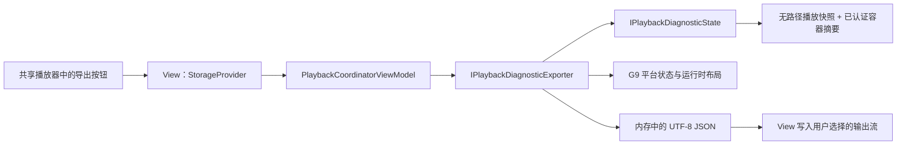

# G10：性能基线与脱敏诊断

## 1. 当前状态

G10 的产品代码、自动化性能入口、真实窗口资源趋势入口和统一验收脚本已经实现。2026-07-26
已从 clean worktree 完成两轮正式运行并建立 Windows x64 审核基线：180 项 MySmallTools
测试、21 项宿主测试、性能硬门禁、短/长真实窗口资源趋势和敏感扫描全部通过。人工保存交互
仍必须按 [G11 最终验收手册](../reference/G11-FINAL-ACCEPTANCE-AND-TEST-GUIDE.md)真实执行并签字，因此
当前不能单凭技术 JSON 宣布最终验收完成。

本阶段没有修改 SECVID03 的磁盘布局、KDF、nonce、AAD、Tag 或兼容规则；生产平台仍只有 Windows x64。

## 2. 产品诊断边界

单文件播放器和媒体库播放器复用 `VideoPlayerControl`，因此共享同一个“导出诊断”入口。View 负责保存位置和输出流，ViewModel 只请求内存中的 JSON，Document-scoped 导出器只读取不可变快照。



设计约束：

- 导出器使用固定 DTO 白名单，不序列化异常、ViewModel、日志或任意字典。
- 当前媒体路径不进入播放诊断状态；容器摘要来自已认证固定头，不包含 FileId。
- 新候选失败不会覆盖旧媒体摘要；释放媒体或关闭 Document 时清空摘要。
- 最后失败只导出枚举错误码和通过 `[A-Z0-9_-]` 白名单的诊断码。
- 插件目录内的运行时位置输出为 `$PLUGIN/...`；目录逃逸只输出 `outside-plugin`。
- JSON 在内存中完整生成，采用 UTF-8、LF，最大 64 KiB。
- 密码、派生密钥、完整文件名、媒体/保存路径、公开标题与描述、媒体内容、原生 stderr、应用日志和块轨迹均不采集。

schema v1 的顶层字段固定为：

| 字段 | 内容 |
| --- | --- |
| `schemaVersion` / `kind` / `createdUtc` | 格式身份和 UTC 生成时间 |
| `redactionProfile` | 当前脱敏策略版本 |
| `platform` | G9 平台 ID、架构、OS 和能力布尔值 |
| `versions` | MySmallTools、.NET、LibVLCSharp 和实际 LibVLC 文件版本 |
| `deployment` | 就绪状态、稳定问题码和脱敏运行时位置 |
| `playback` | 状态、活动、能力和稳定错误域 |
| `container` | 当前已认证 SECVID03 结构摘要；没有时为 `null` |
| `resources` | 八类播放资源及进程资源即时值 |
| `privacy` | 明确声明未采集的数据类别 |

错误域固定为 `platform`、`deployment`、`format`、`authentication`、`io`、`decode`、`operation`、`unknown` 和无失败时的 `none`。

## 3. 缓存统计

`SecurePlaybackDiagnostics.CaptureCacheStatistics()` 返回累计的 `Requests`、`Hits`、`Misses` 和 `Evictions`。统计点位于四块 LRU 内部：

- 每次请求块时增加 `Requests`。
- 已存在于四块缓存时增加 `Hits`。
- 实际认证解密时增加 `Misses`。
- 第五个不同块复用最旧缓冲区时增加 `Evictions`。

产品诊断只导出资源即时计数，不导出块编号和 Seek 位置；累计缓存统计用于测试和性能报告。

## 4. 性能套件

原 G1 命令保持不变。G10 使用：

```powershell
dotnet run --project .\Plugins\MySmallTools\MySmallTools.SecurityBenchmarks\MySmallTools.SecurityBenchmarks.csproj -c Release -- --suite g10 --output .\artifacts\MySmallTools\g10\g10-performance.json
```

默认场景：

- 8 MiB 预热一次。
- 64 MiB 加解密 5 次，512 MiB 加解密 1 次；两种规模使用独立子进程。
- 固定随机种子执行 256 次、每次 64 KiB 的随机 Seek。
- 真实四块 LRU 执行命中、第五块进入和最旧块淘汰序列。
- 生产扫描器执行 100/1,000 文件冷/热扫描。
- 生产浏览 ViewModel 走 150 ms 防抖路径完成搜索和八种排序组合。
- 生产目录会话测量新增、修改、重命名、删除，并执行 256 唯一路径事件风暴。

报告包含吞吐、耗时、median/P95、缓存统计、托管堆/Working Set/Private Bytes 峰值增量、Gen2 和 GC 暂停增量。硬门禁验证 SHA-256、partial 清理、独占重开、四块上限、LRU 语义、目录事实一致、会话取消和大文件内存非线性增长。

## 5. 真实播放器资源趋势

Integration Harness 增加 `--suite g10`。统一脚本每轮分别启动短、长两个独立宿主进程：

| 场景 | Player 创建/释放 | 媒体切换 | Dock 表面重建 |
| --- | ---: | ---: | ---: |
| 短场景 | 20 | 10 | 10 |
| 长场景 | 100 | 50 | 50 |

宿主稳定后记录基准点，关闭全部 Document、完成两轮 GC 后记录终点。既有真实播放门禁继续验证 UI heartbeat、原生输出代次和八类资源归零；统一脚本再比较短/长保留增量。

资源趋势同时检查已关闭的 Document、View 和解密流弱引用全部归零。Dock 内容回收器在最终关闭时只移除对应缓存项；播放器中不可见的进度条不会继续运行无限动画，避免 Avalonia 媒体时钟保留已经关闭的控件树。普通标签切换仍复用原 View，不触发最终释放。

## 6. 基线比较

至少三轮性能报告使用 `--g10-aggregate` 聚合。可比指纹包括平台、进程架构、CPU 型号、逻辑处理器数、.NET、Release 配置、MySmallTools、LibVLCSharp 和 LibVLC 版本。OS Build 与可用物理内存仅记录。

同指纹时：

- 延迟 median 上限为 `max(基线 × 1.30, 基线 + 2 ms)`。
- 延迟 P95 上限为 `max(基线 × 1.50, 基线 + 5 ms)`。
- 吞吐 median 下限为 `基线 × 0.75`。
- 两轮 median 取两轮中位数，P95 取较差值。
- 任一正确性、内存、缓存或资源硬门禁失败时直接失败。

不同环境指纹或场景参数签名不一致时，硬门禁照常执行，耗时结果标记为 `notComparable`。本地可用 `-AllowNonComparable` 保留报告，但不能形成正式技术验收。`-UpdateBaseline` 只接受默认 64/512 MiB、100/1,000 文件、256 事件和完整窗口门禁。

## 7. 统一验收

```powershell
.\scripts\Accept-MySmallToolsG10.ps1
```

首次建立审核基线必须在 clean worktree 上显式执行：

```powershell
.\scripts\Accept-MySmallToolsG10.ps1 -UpdateBaseline
```

开发中可使用 `-AllowDirty`；仅检查非窗口部分可再加 `-SkipWindowGates`。这两种运行都不会被标记为正式证据。

脚本串行执行 Release 零警告构建、插件与宿主全量测试、三轮性能套件、三轮短/长真实窗口趋势、产品诊断样本、基线比较和敏感 canary 扫描。目录约定：

- 当前审核基线：`docs/secret-video-player/benchmarks/g10-windows-x64-net10-avalonia12-dock12-reference.json`
- 升级前归档：`docs/secret-video-player/benchmarks/archive/g10-windows-x64-net9-legacy.json`
- 可提交证据：`TestResults/G10/`
- 大素材和中间文件：`artifacts/MySmallTools/g10/`

G11 通过 `-EvidenceRoot` 把 G10 阶段摘要暂存到 ignored artifacts，使 G4、G8、G10 能在
同一个 clean 源码快照上连续运行。该参数不改变本脚本原有默认目录和单独执行方式。

## 8. 完成判定

以下条件全部满足前，路线图只能标记“技术实现完成”：

- clean worktree 上至少三轮完整性能和真实窗口门禁通过。
- 可比环境没有越过耗时阈值，所有硬门禁通过。
- 敏感扫描为零发现。
- Release 构建零警告，G0～G9 回归全部通过。
- 单文件和媒体库页面的正常、错误密码、部署不可用、取消及无写权限导出交互已人工签字。
