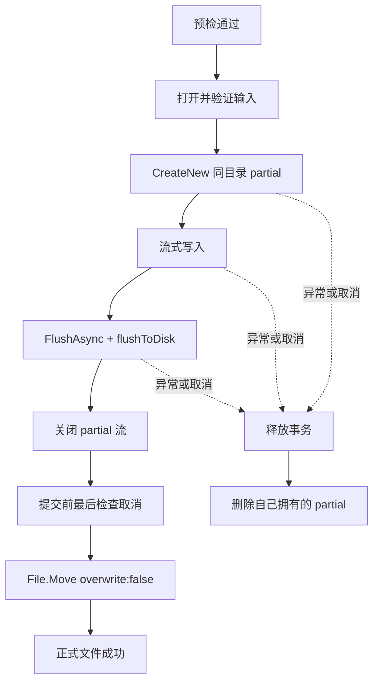

# G2：加解密预检、错误与资源闭环

> 实施日期：2026-07-23
>
> 适用范围：MySmallTools 安全视频加密 Document、批量解密 Document、SECVID03 单文件加解密器与 MySmallTools.Tests
>
> 兼容原则：不改变 SECVID03 魔数、磁盘布局、PBKDF2、AES-GCM、nonce、AAD、块大小或 Tag

## 1. 完成目标

G2 在 G1 格式与安全证据之上，补齐加解密操作的产品可靠性闭环：

- 加密侧增加 `IVideoEncryptionService` 和 `ISecvid03Encryptor`，ViewModel 不再依赖具体实现。
- 加密和解密共用任务状态、预检严重级别、进度与稳定失败代码。
- 输入、输出冲突、目录可写性、目标竞争和磁盘空间在执行前得到检查。
- 加解密通过同一个输出事务对象写入唯一 partial，刷新并关闭后以不覆盖方式提交。
- 错误密码在创建明文 partial 前失败；块篡改、取消和磁盘错误只清理当前半成品。
- Document 关闭只取消自身操作、清空密码并拒绝迟到回调，不影响其他 Document。
- 批量解密重新预检未成功项，按顺序执行并保留之前已经提交的文件。

G2 没有增加批量加密、持久任务、后台 Coordinator、SECVID02 兼容或新的诊断存储。

## 2. 实施前问题

| 编号 | 问题 | 风险 |
| --- | --- | --- |
| G2-F01 | `VideoEncryptorService` 没有接口，直接接收并修改 UI `EncryptionTask` | 难以替换测试，加密用例与界面状态耦合 |
| G2-F02 | `EncryptionTask` 保存密码 | 密码被复制到长生命周期任务模型 |
| G2-F03 | 加密最终使用 `File.Move(..., overwrite: true)` | 预检后的竞争可覆盖用户文件 |
| G2-F04 | 加解密使用不同状态、进度和失败枚举 | UI 与测试无法稳定表达同类错误 |
| G2-F05 | 解密仅检查候选公开信息，加密没有正式预检 | 权限、空间和路径问题通常到写入中途才暴露 |
| G2-F06 | 加密器和解密器分别实现 partial 生命周期 | 提交和清理语义可能继续漂移 |
| G2-F07 | 加密错误直接显示原始 `Exception.Message` | 用户提示不可控，也可能夹带路径或实现细节 |

上述问题均在 G2 中处理；没有发现需要升级 SECVID03 格式的问题。

## 3. SOLID 边界与设计模式

G2 只使用三个直接服务于业务风险的模式：

1. **应用服务**：`IVideoEncryptionService` 和 `IVideoDecryptionService` 编排预检、执行和批次隔离，不实现密码学。
2. **事务对象**：`IOutputFileTransaction` 独占一个 partial，负责刷新、关闭、不覆盖提交和未提交回滚。
3. **端口与适配器**：`IStoragePreflightProbe`、单文件加解密接口和事务工厂提供窄测试边界。

职责划分如下：

| 组件 | 单一职责 |
| --- | --- |
| 加密/解密 ViewModel | 表单、队列、命令、取消源和当前 Document 密码 |
| 应用服务 | 业务预检、失败映射、顺序编排和进度汇总 |
| `StoragePreflightProbe` | 目录创建策略、写入探针和可用空间 |
| `Secvid03Encryptor` / `Secvid03Decryptor` | 单文件 SECVID03 流式算法 |
| `OutputFileTransaction` | 一个输出文件的提交或回滚 |
| `DecryptionOutputPathResolver` | 净化不可信公开文件名并分配不冲突路径 |

ViewModel 只依赖服务接口；加密与解密服务保持分离，没有合并成万能执行器。文件系统也没有被完整抽象，只在需要故障注入或统一所有权的位置建立窄接口。

## 4. 统一任务和错误契约

任务状态为：

```text
Pending → Preflighting → Ready → Running → Succeeded
                         ↓         ↓
                       Failed ←────┘
                         ↑
              Failed/Cancelled 可重新预检
Running/Preflighting → Cancelled
```

预检问题只有两种严重级别：

- `Warning`：当前无法取得可靠空间信息等非确定性问题；显示后允许继续。
- `Blocking`：输入、路径、冲突、权限或已知空间不足；不得进入加解密器。

稳定失败代码及边界：

| 代码 | 含义 |
| --- | --- |
| `InvalidRequest` | 缺少路径、加密密码少于 6 个字符或公开信息超限 |
| `InvalidFormat` | 不是结构合法的 SECVID03 |
| `AuthenticationFailed` | 密码错误或固定头认证失败 |
| `CorruptedContent` | 认证后发现块篡改或输入截断 |
| `InputUnavailable` | 输入不存在、被占用或无法读取 |
| `InputOutputConflict` | 输入和输出规范化后为同一路径 |
| `OutputConflict` | 目标已存在或提交时被竞争创建 |
| `PermissionDenied` | 输入或输出访问被拒绝 |
| `InsufficientDiskSpace` | 预检空间不足，或 Windows 返回磁盘满错误 |
| `DiskIo` | 其他输出设备或文件系统错误 |
| `CleanupFailed` | partial 或写入探针在所有流关闭后仍无法删除 |
| `Cancelled` | 用户取消或 Document 关闭 |
| `Unknown` | 无法安全分类的异常 |

`VideoTaskException` 对外只带稳定代码和预定义安全消息。原始异常可以作为内部 `InnerException` 保留，但 ViewModel 不显示堆栈或原始文本。

## 5. 预检

### 5.1 加密

加密预检按以下顺序执行：

1. 验证输入、输出路径和公开信息长度。
2. 规范化路径并拒绝输入输出相同。
3. 若显式目标已存在，返回 `OutputConflict`，不自动改名。
4. 以只读流打开输入，检测原视频前缀长度。
5. 使用 G1 的 `Secvid03Layout` 精确计算容器物理长度。
6. 按现有产品行为创建缺失的输出目录。
7. 在目标目录创建、关闭并删除唯一零字节探针。
8. 获取输出卷可用空间；已知不足时阻止，无法可靠获取时警告。

应用服务执行前再次预检。预检不是锁，最终提交仍必须使用不覆盖语义抵御 TOCTOU 竞争。

### 5.2 解密

解密保留两级检查：

- 添加文件时的 `InspectAsync` 不接收密码，只检查扩展名、输入可用性、SECVID03 结构和公开区。
- 开始批次时重新检查所有未成功项，再检查输出目录、净化名称、批次内重名和累计空间。

输出目录不存在会阻止整个批次。单项格式或空间问题只阻止该项，其余 Ready 项继续。网络目录等无法取得空间的情况显示批次警告，但仍允许执行。

普通预检不验证密码，避免每个文件重复执行两次 600,000 次 PBKDF2。密码认证仍是单文件解密的准备阶段，并严格位于明文事务创建之前。

## 6. 事务式输出



提交点是 `File.Move` 成功。取消在提交前生效；移动成功后即报告成功，不能把已存在的正式文件误报为取消。

加密和解密不再分别拼接、移动和删除 partial。事务 Dispose 即使遇到流关闭错误也会继续尝试删除；主操作错误和清理错误同时存在时，不用清理错误替换主错误。

## 7. 加密与解密行为

### 7.1 加密

- `VideoEncryptionRequest` 只包含输入、输出、公开标题和公开描述。
- 密码作为 `EncryptAsync` 独立参数从 Document 传到同步调用链。
- 原 `EncryptionTask` 已删除；任务状态直接由 ViewModel 和不可变进度快照维护。
- 输入中途截断、目标竞争、权限和磁盘满被映射为稳定代码。
- 失败或取消后可再次点击开始；新操作使用新取消源、重新预检和新的 partial。

### 7.2 批量解密

- 队列项保存候选公开信息、状态、进度、输出和非敏感失败代码，不保存密码。
- 失败或取消项在下次开始时重新检查；同一批次的成功项不重跑。
- 错误密码、内容损坏和单项 I/O 错误只标记当前项，继续后续项。
- 取消当前批次时，当前项和未开始项进入 `Cancelled`，此前成功文件保持不变。
- 解密输出名继续通过 `DecryptionOutputPathResolver` 净化，并用数字后缀避让现有文件。

单项取消、取消全部、移除等待项和批量加密仍属于 G5。

## 8. Document 与敏感信息

每个加密或解密 Document 由独立 DI Scope 创建。Dispose 顺序为：

1. 标记 Document 已释放并增加操作代次。
2. 清空密码和确认密码。
3. 对当前取消源发送取消。
4. 不在 UI 线程同步等待。
5. 异步调用自行释放输入流、输出事务、密码学上下文和缓冲区。
6. 迟到进度因代次或 `_disposed` 检查被丢弃。

自动化反射检查确认 `VideoEncryptionRequest`、预检、进度、候选和批次结果没有 Password 成员。错误和界面提示不拼接密码或原始异常。

## 9. 验证结果

### 9.1 自动化

2026-07-23 Release 验证：

| 项目 | 结果 |
| --- | --- |
| `MySmallTools` 独立构建 | 0 警告、0 错误 |
| `MySmallTools.Tests` | 69/69 通过 |
| `MyAvaloniaManagement.PluginTests` | 15/15 通过 |

G2 新增 8 项专项测试，覆盖：

- 精确容器空间估算、输入输出相同和目标已存在。
- partial 回滚、提交竞争和正式目标不覆盖。
- 错误密码在明文事务创建前失败。
- 写入中模拟 Windows 磁盘满并返回稳定代码。
- 解密批次累计空间，只阻止超出容量的后续项。
- 请求、队列、进度和结果模型无 Password 成员。
- 加密服务可替换，不需要真实大文件即可测试调用边界。
- 两个加密 Document 取消隔离、Dispose 清空密码和迟到回调失效。

原有 G1 固定向量、篡改、路径、资源、播放器和媒体库测试全部保留。

### 9.2 环境验收

- 真实文件系统完成写入探针创建/删除、partial 回滚和提交竞争验证。
- 64 MiB 流式加密取消及 Document 关闭验证没有正式输出或 partial 残留。
- 错误密码和真实篡改容器验证没有明文输出。
- 实际耗尽磁盘和修改宿主机 ACL 会破坏开发环境，因此使用可注入事务流和稳定 Windows HResult 做确定性替代；实际目录权限仍由同一异常分类路径处理。
- 两组 Avalonia XAML 在 Release 构建中编译通过；本阶段未把视觉样式快照作为发布门禁。

宿主插件测试构建仍显示 `DaTangAccountingHelpPlug` 的既有警告；MySmallTools 没有新增警告。

## 10. 实施结论

G2-F01 至 G2-F07 已全部关闭。加密和解密现在具有一致的预检、状态、错误与事务资源语义；密码不再存在于加密任务模型；任何正式输出都使用不覆盖提交。

G3 可以在此基础上继续处理真实 LibVLC 播放、Seek、Dock 表面恢复和播放错误传播。G5 再扩展批量加密及更细的队列交互，不应把 G2 的单 Document 生命周期改为全局任务中心。
