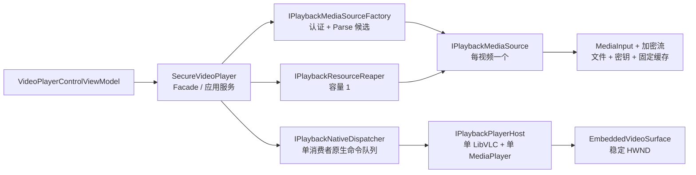

# G3.1：播放切换异步化与 UI 响应性优化

> 阶段位置：G3 与 G4 之间
> 实施日期：2026-07-24
> 当前状态：已完成
> 适用基线：Windows x64、LibVLCSharp 3.9.4、LibVLC 3.0.21、SECVID03

## 1. 目标与非目标

### 1.1 目标

G3.1 的本质目标不是让 LibVLC 的 Stop、解析或资源释放变快，而是让这些耗时工作不再挂起
Avalonia UI Dispatcher。用户执行停止或切换视频后，界面必须立即显示当前阶段并继续响应绘制、
窗口移动和其他消息；内部操作可以按原生播放器实际耗时完成。

本阶段同时把 G3 的播放实现收敛为：

- 每个 Document 一个 `LibVLC`。
- 每个 Document 一个 `MediaPlayer`。
- 每个 Document 一个稳定的 `VideoView/HWND` 绑定。
- 每个视频一个可替换的 `MediaSource`。
- 原生播放器命令在一个 Document-scoped 单消费者中严格串行执行。
- 已与播放器解绑的旧 Source 在有界后台回收器中确定性释放。

### 1.2 非目标

- 不承诺 Stop 或视频切换在固定毫秒内完成。
- 不以任务管理器中的 Working Set 曲线平滑作为验收标准。
- 不创建双播放器、双 HWND 或预热播放器池。
- 不允许多个无界 `Task.Run` 同时回收旧媒体。
- 不修改 SECVID03 格式、认证边界、密码生命周期或缓存上限。
- 不把普通切换的异步承诺扩大到 Dock HWND 销毁；Dock 销毁仍优先保证旧 vout 已停止。
- 不新增原生 MP4 直通分支。普通 MP4 与 SECVID03 的读链路不同，不应通过绕过安全容器来掩盖问题。

## 2. 问题证据与大视频内存抖动分析

### 2.1 已确认的托管缓存边界

`SeekableEncryptedVideoStream` 只保留有限数量的 1 MiB 明文块，默认约 4 MiB；叠加输入适配、
认证和读缓冲后，安全播放链路中可归因于应用的固定明文缓存约为 6 MiB。它不按 2 GiB 文件长度
分配等量数组，也不会把完整明文视频加载到内存。

因此，“播放 2 GiB 视频时进程增加数百 MiB”不能直接推导为应用把整个文件读入内存。

### 2.2 数百 MiB 的主要来源

大幅增长通常来自 LibVLC 和图形栈的原生工作集：

- 压缩数据预读和 demux 队列。
- 音视频解码器参考帧、重排序帧和输出帧。
- D3D11 纹理、交换链和 vout 相关缓冲。
- 硬件解码驱动及进程内原生分配器保留的内存。
- Stop、Media 替换和新 Play 交叠期间，旧解码资源尚未完全退出而新解码资源已经建立。

这些内存不属于 .NET GC 管理。GC、LOH 正常回落并不能说明原生帧和纹理已经释放；反过来，
Working Set 没有立刻回落也不等于发生泄漏，因为操作系统和原生分配器可能保留已提交页以便复用。

### 2.3 为什么 SECVID03 比原生 MP4 更明显

原生 MP4 可由 LibVLC 直接通过文件系统访问、缓存和内存映射。SECVID03 则必须经过
`MediaInput -> SeekableEncryptedVideoStream -> AES-GCM 认证/解密 -> 文件随机读取`。
这个业务链路会增加回调、Seek、认证和小规模固定缓冲成本，但不会产生与视频总长度线性相关的
托管内存。

更明显的抖动主要不是“加密视频必须占几百 MiB”的固定业务税，而是旧架构把
`MediaPlayer`、`Media`、输入流和文件资源放在同一个 Lease 中。每次换片都会释放整套原生播放器、
解绑 VideoView，再创建一套播放器和解码输出。旧 vout 退出、新 vout 建立和 GC/原生释放集中在
一次 UI 操作中，于是内存曲线和 5 秒卡顿同时出现。

### 2.4 G3.1 能解决什么

G3.1 保留唯一 `MediaPlayer` 和 HWND，避免每次换片都重建播放器与视频输出；Stop、Media setter、
Play 和 Source Dispose 被移出 UI 线程。它会显著降低“整套播放器重建”导致的抖动，并保证界面
响应，但不会消除编解码器本身在停止后释放、播放后重新申请帧和纹理的正常涨落。

验收因此关注以下事实：

- UI Dispatcher 在 Stop 和切换期间持续处理 heartbeat。
- 托管缓存不随视频文件长度增长。
- Document 内 `MediaPlayer` 引用和普通切换前后的表面代次不变。
- 旧 Source 最终释放，Document 关闭后资源计数归零。
- 允许 Stop 后内存下降、Play 后再次上涨。

## 3. 架构设计



### 3.1 `IPlaybackPlayerHost`

`LibVlcDocumentPlayerHost` 是 Document 级唯一所有者，负责：

- 创建和释放一个 `LibVLC` 与一个 `MediaPlayer`。
- Attach/Detach `Media`。
- Play、Pause、Stop、Seek、音量和视频输出句柄。
- 把原生事件转换为携带媒体代次的应用事件。
- 在 Dock 表面恢复时复用 G3 的安全恢复序列。

它不打开 SECVID03 文件，不保存密码，不决定用户意图。普通媒体切换只替换 `Media`，
不替换 Host、MediaPlayer 或 HWND。

### 3.2 `IPlaybackMediaSource`

`LibVlcPlaybackMediaSource` 是每视频一个的资源聚合根，拥有：

- LibVLC `Media`。
- `SeekableStreamMediaInput`。
- `SeekableEncryptedVideoStream`。
- 文件句柄、认证/派生密钥上下文和固定明文缓存。

`PrepareForPlayback` 重新开放输入读取，`RequestStop` 使正在进行或后续的输入回调尽快退出。
Source 不控制播放器和表面；只有从 PlayerHost 解绑后才允许交给 Reaper。

### 3.3 `IPlaybackMediaSourceFactory`

工厂负责校验请求、打开和认证 SECVID03、创建 `MediaInput/Media`，并执行最多 15 秒的 Parse。
候选创建在后台执行，且不占用原生播放器命令队列，所以当前视频可以继续保持原状态。
工厂失败时只释放候选资源，不修改当前播放器。

### 3.4 `IPlaybackNativeDispatcher`

调度器使用一个长期后台消费者和 Channel：

- 同一 Document 的所有原生播放器控制严格串行。
- `TaskCompletionSource` 使用 `RunContinuationsAsynchronously`，防止业务延续代码内联到消费者。
- 未开始的工作尊重取消；一旦 Stop、Media setter 或 Dispose 开始，就运行到安全终点。
- Debug 日志记录操作名、排队耗时、执行耗时、线程 ID 和成功/失败。
- 普通路径不在 UI 线程调用 Parse、SetPause、Stop、Media setter、Play 或 Dispose。

### 3.5 `IPlaybackResourceReaper`

回收器同样是 Document-scoped 单消费者，但 Channel 固定容量为 1：

- 最多一个 Source 正在释放、一个 Source 等待释放。
- 队列满时提交方异步等待，形成背压，不阻塞 UI 线程。
- 新媒体提交成功后先释放播放器操作门，再等待回收器接管旧 Source；因此新媒体仍可 Play、
  Pause 和 Seek。
- 回收器不访问 PlayerHost、MediaPlayer、HWND、ViewModel 或 Avalonia Dispatcher。
- Document Scope 关闭时停止接收，并等待已接管资源释放完成。

回收顺序为：

```text
Media.Dispose
  → MediaInput.Dispose
  → SeekableEncryptedVideoStream.Dispose
  → 文件句柄关闭
  → 明文缓存清零
  → 密钥上下文释放
```

### 3.6 SOLID 与务实设计模式

| 原则/模式 | 使用位置 | 设计意图 |
| --- | --- | --- |
| 单一职责 | Host、Source、Factory、Dispatcher、Reaper | 播放器、文件资源、候选创建、线程调度和回收不再混在 Lease 中 |
| 开闭原则 | 各窄接口 | 可替换调度和测试替身，不修改 Facade 的用户意图语义 |
| 里氏替换 | Fake Host/Source | 单测无需创建真实 LibVLC 即可验证事务时序 |
| 接口隔离 | 五个小接口 | ViewModel 不接触 LibVLC，Reaper 不获得 PlayerHost |
| 依赖倒置 | `SecureVideoPlayer` 依赖接口 | 应用编排不依赖 Channel、文件流或具体原生对象 |
| Facade | `SecureVideoPlayer` | 对 UI 提供稳定、窄的播放会话 |
| Command Queue | NativeDispatcher | 将原生命令串行化并移出 UI |
| Factory | MediaSourceFactory | 集中候选构造和失败清理 |
| Transaction + Compensation | 媒体提交/回滚 | Attach 或 Play 失败时重新绑定未回收的旧 Media |
| Generation Token | 用户意图、媒体、表面 | 拒绝迟到候选、旧原生事件和旧 Dock 恢复 |
| Bounded Producer/Consumer | ResourceReaper | 后台回收有界且具背压 |

没有引入通用工作流框架、事件总线或播放器池；这些抽象不会改善当前问题，反而会扩大资源所有权。

## 4. 操作时序

### 4.1 Load-only

1. 推进用户意图代次并取消旧候选。
2. 发布 `PreparingCandidate`。
3. 后台打开、认证和 Parse 候选 Source。
4. 验证取消令牌和意图代次。
5. 取得操作门并在 NativeDispatcher 中停止旧媒体、Detach、Attach 候选。
6. 发布 `Ready/Idle`。
7. 旧 Source 解绑后交给 Reaper。

### 4.2 Load-and-play

与 Load-only 共用同一事务，但 Attach 后继续发布 `StartingPlayback`，调用
`PrepareForPlayback -> MediaPlayer.Play`，成功后发布 `Playing`。ViewModel 直接调用
`LoadAndPlayAsync`，不再把自动播放拆为可被其他意图插入的 `LoadAsync -> PlayAsync`。

### 4.3 Stop 与 Stop 期间 Play

Stop 先发布 `Stopping` 并使 UI 停止位置轮询，然后在 NativeDispatcher 执行：

```text
SetPause(true) → Source.RequestStop() → MediaPlayer.Stop()
```

Source 保留并继续绑定，所以 Stop 后可重新播放同一媒体。若 Stop 尚未结束时收到 Play，
Play 在操作门后异步等待，不与 Stop 并发；UI 显示 `WaitingForPlayer`。

### 4.4 Release

Release 在 NativeDispatcher 中 Stop 并 Detach，随后把 Source 交给 Reaper且等待释放完成。
显式 Release 的调用方可能立即编辑、改名或删除文件，因此与普通换片不同，它必须等文件锁关闭。

### 4.5 失败回滚

- 候选认证或 Parse 失败：当前 Source 和播放器完全不变。
- Stop 失败：保留当前 Source，发布类型化失败，不释放仍可能被原生线程使用的对象。
- Attach 失败：立即重新 Attach 尚未回收的旧 Source。
- 新 Play 返回 false、抛异常或在提交后取消：执行补偿事务，Detach 失败候选并重新 Attach 旧 Source。
- 已进入 Playing 后的异步解码错误：沿用 G3 类型化错误，不自动回退旧视频。

### 4.6 快速连续切换

每个 Load 都获得新的意图代次并取消前一候选。候选即使迟到完成，也必须再次检查代次；
只有最后意图可以进入提交区。已经开始的原生提交不强制中断，后一意图在操作门后等待其完成。

## 5. 线程与资源规则

普通播放路径的 UI 线程禁止直接调用：

- `Media.Parse`
- `MediaPlayer.SetPause`
- `MediaPlayer.Stop`
- `MediaPlayer.Media` setter
- `MediaPlayer.Play`
- Source/Media/Input 的耗时释放

线程规则：

- 候选认证和 Parse 使用后台工作线程，不占用 NativeDispatcher。
- PlayerHost 的控制方法只由 NativeDispatcher 串行调用。
- 未开始工作可取消；已开始的 Stop、Media 替换和 Dispose 必须完成。
- Source 只有在 `MediaPlayer.Media = null` 后才可异步回收。
- Reaper 只释放它已接管的 Source，不读取当前会话状态。
- 普通播放路径不使用 `.Wait()`、`.Result` 或 `.GetAwaiter().GetResult()`。

例外：

- Dock 即将销毁 HWND 时，`DetachSurface` 保留 G3 的同步安全屏障，确认旧 vout 停止后才允许
  句柄销毁。
- Document 最终 Dispose 等待 Dispatcher/Reaper 收口，优先保证文件锁和密钥确定性释放。

## 6. 状态、提示和命令可用性

`PlaybackSnapshot.Activity` 与最终 `PlaybackState` 分离：

| Activity | UI 提示 | 冲突命令 |
| --- | --- | --- |
| `Idle` | 按最终 State 显示 | 按正常能力开放 |
| `PreparingCandidate` | 正在验证并解析新视频… | 禁用冲突播放命令 |
| `WaitingForPlayer` | 播放器正在完成上一操作… | 等待当前串行操作 |
| `StoppingCurrent` | 正在停止当前视频… | 禁用冲突命令 |
| `AttachingCandidate` | 正在切换媒体… | 禁用冲突命令 |
| `StartingPlayback` | 正在启动新视频… | 禁用冲突命令 |
| `Stopping` | 正在停止并释放解码资源… | 禁用冲突命令 |
| `ReleasingOldMedia` | 新视频已启动，正在后台清理旧资源… | 当前媒体控制保持可执行 |

`IsTransitioning` 保留为兼容属性，由 Activity 推导。播放位置计时器只在 `Playing + Idle`
时运行，避免过渡期轮询继续向原生队列施压。

## 7. 内存行为与成功标准

预期曲线仍可能是：

```text
Play：解码帧/纹理建立，Working Set 上涨
Stop：原生队列退出，Working Set 延迟下降或由分配器保留
Switch：短时间存在新旧资源交叠
New Play：新解码帧/纹理建立，Working Set 再次上涨
```

G3.1 的成功标准不是强制操作系统立即回收工作集，而是：

- 只有一个 Document 级 Player 和输出表面。
- 托管明文缓存仍为固定上限，不随 2 GiB 文件长度增长。
- 旧 Source 最终释放，文件锁、输入、加密流和缓存计数归零。
- Stop/切换期间 UI heartbeat 持续运行。
- Working Set、Private Bytes、GC、LOH 和资源计数在同一性能日志中记录，区分托管和原生来源。

## 8. 测试矩阵和性能证据

### 8.1 自动化测试

G3.1 新增或迁移以下断言：

- 候选失败不替换当前 Source。
- Attach 失败会先恢复旧 Source，再回收候选。
- 新 Play 立即失败会执行补偿事务并恢复旧 Source。
- 快速连续 Load 只有最后意图提交。
- 旧媒体代次事件不能覆盖新状态。
- Pause 幂等。
- 阻塞 Fake Stop 时，调用线程立即获得未完成 Task，Stop 在线程 ID 不同的消费者上执行。
- Stop 期间 Play 等待 Stop，随后复用同一 Source。
- `LoadAndPlayAsync` 发布准备、挂载、启动和 Idle 活动序列。
- Reaper 容量为 1，第三个 Source 提交产生异步背压。
- Stop 后重新 Play 不创建新 Source。
- 既有 MediaInput 类型化错误和 Dock 恢复测试继续保留。

### 8.2 Windows x64 真实窗口门禁

在 G3 全部门禁上增加：

- Stop 与 30 次快速切换期间运行真实 Avalonia `DispatcherTimer` heartbeat。
- 报告操作期间 tick 数、操作耗时和最大 heartbeat 间隔。
- 普通切换前后 `VideoView.MediaPlayer` 引用相同。
- 普通切换前后表面代次相同，即不创建新 HWND。
- `PlaybackResourceSnapshot` 增加 NativeDispatcher 和 ResourceReaper 活动计数。
- 100 次 Document 生命周期后 Player、Source、Input、流、缓存、Dispatcher 和 Reaper 全部归零。

不使用固定的跨机器 Stop/切换耗时阈值；非瞬时操作期间至少要观察到一次 UI heartbeat。

### 8.3 Debug 性能日志

日志记录：

- 候选认证和 Parse 合计耗时。
- 原生命令排队耗时、执行耗时和线程 ID。
- Stop、Detach/Attach、首次 Play 的阶段耗时。
- Source 回收耗时和线程 ID。
- GC Gen2、LOH、GC Pause、Working Set 和 Private Bytes 变化。
- 真实窗口门禁的 UI heartbeat 最大间隔。

日志不包含密码、密钥、完整用户路径或媒体内容。

## 9. 实施结果

### 9.1 已完成代码

- `PlaybackMediaLease` 的混合职责已拆分为 PlayerHost、MediaSource 和 Factory。
- DI Scope 已改为每 Document 创建一个 Host、Dispatcher 和 Reaper。
- `SecureVideoPlayer` 已改为单 MediaPlayer 的事务式 Facade。
- Stop、Play、Pause、Seek、Media 替换和音量控制已迁移至 NativeDispatcher。
- 旧 Source 回收已迁移至容量为 1 的 ResourceReaper。
- 新增 `PlaybackActivity`、阶段提示和组合式 `LoadAndPlayAsync`。
- 普通媒体切换不再触发 `OutputChanged`，VideoView 保持同一 Player/HWND。
- Debug 性能记录已覆盖原生队列、回收、GC、Working Set 和 Private Bytes。
- 真实窗口门禁已加入 heartbeat、稳定 Player 和稳定表面断言。

### 9.2 当前验证记录

| 验证项 | 结果 |
| --- | --- |
| MySmallTools Release 单元测试 | 88/88 通过 |
| MySmallTools Debug 单元测试 | 88/88 通过 |
| 宿主插件 Debug/Release 测试 | 15/15、15/15 通过 |
| MySmallTools Release 独立构建 | 0 警告、0 错误 |
| IntegrationHarness Release 构建 | 0 警告、0 错误 |
| Windows x64 真实窗口门禁第 1 轮 | 通过；100 生命周期、20+20 Dock、30 切换 |
| Windows x64 真实窗口门禁第 2 轮 | 通过；100 生命周期、20+20 Dock、30 切换 |

真实门禁 UI 响应证据：

| 轮次 | Stop 耗时/活动期 heartbeat | 30 次切换耗时/活动期 heartbeat | 最大 heartbeat 间隔 |
| --- | --- | --- | --- |
| 第 1 轮 | 98 ms / 7 次 | 610 ms / 37 次 | 22 ms |
| 第 2 轮 | 96 ms / 5 次 | 597 ms / 37 次 | 22 ms |

以上耗时只描述本次机器，不作为跨机器固定阈值。两轮最终资源均为：

```text
LiveLeases=0
LivePlayers=0
LiveMediaInputs=0
LiveEncryptedStreams=0
ActiveSurfaceRestores=0
CachedPlaintextChunks=0
LiveNativeDispatchers=0
LiveResourceReapers=0
```

结构化报告：

- `TestResults/G3.1/g3.1-playback-windows-x64-run1.json`
- `TestResults/G3.1/g3.1-playback-windows-x64-run2.json`

两轮报告同时证明普通换片前后 MediaPlayer 引用与表面代次相同、快速切换只有最后意图提交、
没有额外顶层 VLC 窗口，真实 MP4/WebM、Pause、Stop→Play、Seek、结束、篡改传播和 Dock
恢复均未回归。LibVLC 仍会向 stderr 输出既有的 `imem`、prefetch 和 D3D11 诊断；
这些上游日志不改变结构化断言结果。

### 9.3 已知边界

- 当前测试资产用于稳定回归，不等同于 2 GiB 大文件性能样本；大文件 Working Set 趋势仍应在
  G4 发布验收环境记录。
- Dock HWND 销毁仍是同步安全边界。若未来要求它也完全异步，需要持久表面或双 HWND 专项设计。
- LibVLC/显卡驱动可能保留已释放内存页；应结合资源计数、文件锁和多轮趋势判断，不根据一次
  任务管理器峰值判断泄漏。
- `PlaybackMediaLease.cs` 文件名为兼容历史保留，文件内实现已经是拆分后的 Source/Host 边界；
  后续可在纯重命名提交中调整，不影响运行语义。

### 9.4 结论

G3.1 已完成。普通 Stop 和媒体切换的完成时间仍由 LibVLC、媒体和设备决定，但耗时阶段不再
挂起 Avalonia UI Dispatcher；单 Player/单 HWND 约束、有界回收、失败回滚和确定性资源闭环
已经形成代码、单测和两轮真实窗口证据。下一阶段恢复为 G4。
