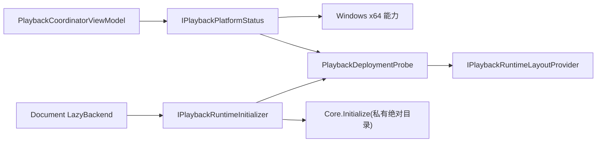
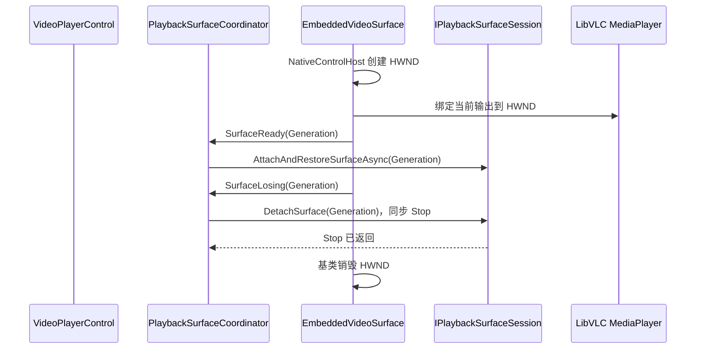

# G9：平台能力与原生表面抽象

> 实施日期：2026-07-26
> 生产平台：Windows x64、.NET 10
> 状态：代码、自动化和真实窗口技术门禁完成；人工窗口确认独立保留

## 1. 目标与边界

G9 把平台判定、插件私有 LibVLC 布局、部署检查、进程级初始化和 HWND 表面绑定从播放
业务中分离。SECVID03、媒体切换事务、密码生命周期、历史格式和每 Document 独立 Scope
均未改变。

Windows x64 仍是唯一生产实现。Linux/macOS 原生表面、原生包、发行流程和系统 VLC 回退
均未交付，不能因为存在接口就宣称跨平台支持。

## 2. SOLID 边界

| 责任 | 端口/实现 | 设计意图 |
| --- | --- | --- |
| 平台能力 | `PlaybackPlatformCapabilities`、`IPlaybackPlatformStatus` | ViewModel 只读取稳定能力和部署结果 |
| 运行时布局 | `IPlaybackRuntimeLayoutProvider` | 只以 MySmallTools.dll 实际位置解析私有目录 |
| 部署验证 | `PlaybackDeploymentProbe` | 只读 PE/程序集/文件系统，不加载 DLL |
| 运行时初始化 | `IPlaybackRuntimeInitializer`、`LibVlcRuntime` | 进程级并发初始化一次，不拥有 Document Player |
| 视频输出 | `IPlaybackVideoOutput` | 只公开稳定输出代次，不公开 `MediaPlayer` |
| 表面身份 | `VideoSurfaceIdentity` | 只保存单调代次，不保存 HWND |
| 表面生命周期 | `IPlaybackVideoSurface`、`PlaybackSurfaceCoordinator` | 编排绑定、同步丢失和异步恢复 |
| Windows 适配 | `EmbeddedVideoSurface` | 唯一读取 `IPlatformHandle.Handle` 和写 `MediaPlayer.Hwnd` 的类型 |

没有增加平台总协调器、事件总线或多层抽象工厂。Windows 实现和测试假实现遵守相同的
“Ready → Losing → 新代次 Ready”语义。

## 3. 运行时与部署数据流

- 布局从插件程序集位置解析 `native/win-x64/libvlc`，不读取工作目录、`PATH` 或系统 VLC。
- 探针继续聚合全部部署问题，保留 G4 问题码、AMD64 PE 检查和必要插件模块检查。
- ViewModel 只有在平台支持且部署通过时才初始化 Document Backend。
- 非 Windows 或非 x64 的假平台门禁证明：Backend 初始化调用为零。

## 4. 原生表面时序

同步丢失屏障没有改为异步：Avalonia 销毁 HWND 前必须等待原生 Stop 返回，否则活动 vout
可能访问失效窗口。全屏和 Dock 只迁移或重建表面；同一 Document 的抽象输出代次保持不变。

## 5. 接口迁移

- 删除带 HWND 的 `VideoSurfaceToken`，替换为 `VideoSurfaceIdentity`。
- 删除公开 `ILibVlcVideoOutputSource.MediaPlayer`，替换为不透明 `IPlaybackVideoOutput`。
- `ISecureVideoPlaybackSession` 只保留媒体和控制用例；表面生命周期移入
  `IPlaybackSurfaceSession`。
- `IPlaybackPlayerHost` 删除 `SetVideoOutputHandle`；PlayerHost 不再拥有 HWND 策略。
- Harness 使用输出代次验证单 Document 单播放器，不读取原生播放器对象。

## 6. 验收结果

- `MySmallTools` Release：0 警告、0 错误。
- `MySmallTools.Tests`：165/165，其中 G9 新增 8 项。
- `MyAvaloniaManagement.PluginTests`：21/21。
- G3 Windows x64：100 次 Document 生命周期、20+20 Dock、30 次快速切换通过，最大 UI
  heartbeat 间隔 27 ms，最终八类资源为零。
- G8 Windows x64 两轮：100 队列、1,000 媒体库、8 Document、10 次全屏和 50 次 Dock
  全部通过；耗时 20,594 ms / 19,538 ms，最大 UI heartbeat 间隔 54 ms / 45 ms，最终
  八类资源均为零。
- 反射守卫确认 ViewModel、播放会话和表面公开契约不包含 `IntPtr` 或 LibVLC 类型。

结构化证据位于 `TestResults/G9`。原始 LibVLC 输出不写入提交证据。
