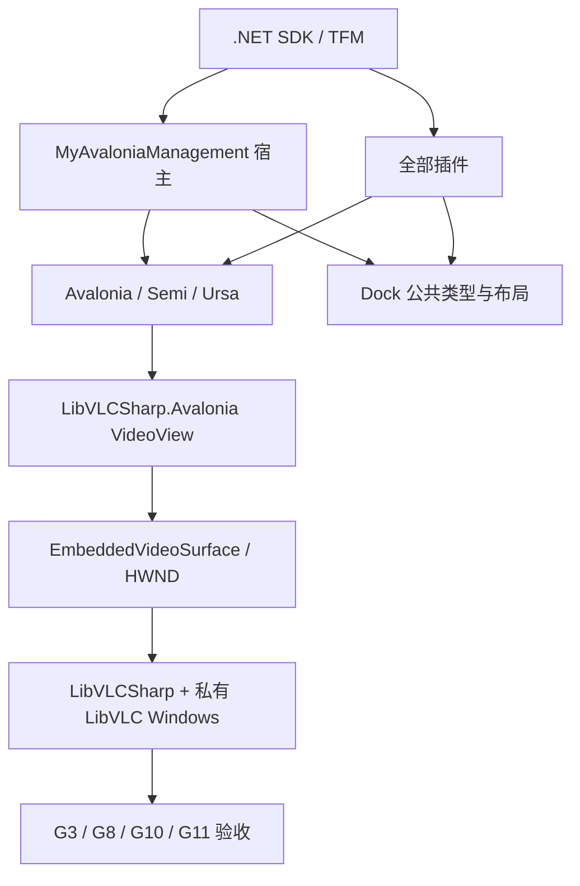

# MySmallTools 播放器与全项目 .NET 10 升级实施指南

> 文档状态：待执行  
> 编制日期：2026-07-26  
> 适用仓库：`MyAvaloniaManagement.sln`  
> 当前生产平台：Windows x64  
> 升级策略：先建立 `.NET 10 + Avalonia 11.3.18` 稳定基座，再通过播放器兼容性闸门决定是否进入 Avalonia 12 / Dock 12  
> 非目标：本轮不交付 Linux/macOS 播放、不临时开发未经验证的自有视频承载层、不修改 SECVID03 格式

## 1. 文档目的

这不是一次只修改 `<TargetFramework>` 的升级。宿主、公共 UI 项目、Dock、全部插件、测试工程、MySmallTools 私有 LibVLC 部署、验收脚本和性能基线共同组成一个发布单元。升级必须保证：

1. 每个阶段都能独立构建、验收和回退。
2. 先获得可发布的 .NET 10 基座，再尝试风险更高的 Avalonia 12 / Dock 12。
3. Avalonia 12 与 `LibVLCSharp.Avalonia.VideoView` 的真实兼容性由运行结果决定，而不是由 NuGet 能否还原决定。
4. 宿主和插件不得混用不同大版本的 Dock 公共类型。
5. 升级前的 G0～G11 证据只作为历史基线；升级完成后重新生成正式证据。

本文按一名程序员独立执行估算。每个阶段都给出输入、操作、交付物、完成条件和回退点。阶段没有达到完成条件时，不得进入下一阶段。

## 2. 已确认的升级前基线

基线采集时间为 2026-07-26；正式开始升级时仍须按阶段 0 重新采集一次。

| 项目 | 当前事实 |
| --- | --- |
| Git 基线 | `54aeabd91747`；执行升级时以实际 HEAD 为准 |
| 本机 SDK | `9.0.315`，尚未安装 .NET 10 SDK |
| 普通项目 TFM | `net9.0` |
| 播放器真实窗口 Harness | `net9.0-windows` |
| MySmallTools 测试 | 180/180 通过 |
| 宿主插件测试 | 21/21 通过 |
| 构建质量 | MySmallTools 自身零警告；DaTangAccountingHelpPlug 仍有历史警告 |
| 依赖治理 | 没有 `global.json`、`Directory.Packages.props`、`Directory.Build.props` 和包锁文件 |
| 持续集成 | 仓库内没有 GitHub Actions 工作流 |
| 安全审计 | Avalonia 11.3.4 间接带入 `Tmds.DBus.Protocol 0.21.2` 高危公告 |
| 正式证据 | G10/G11 绑定旧提交、.NET 9 和旧依赖；升级后不可直接复用 |

解决方案中的项目：

| 子系统 | 项目 |
| --- | --- |
| 宿主 | `Host/MyAvaloniaManagement/MyAvaloniaManagement.csproj` |
| 公共 UI 与 Dock | `Host/MyAvaloniaManagementCommon/MyAvaloniaManagementCommon.csproj` |
| 宿主插件测试 | `Host/MyAvaloniaManagement.PluginTests/MyAvaloniaManagement.PluginTests.csproj` |
| BiliDownloader | 主项目及测试项目 |
| DaTangAccountingHelpPlug | 主项目 |
| MyPlugTest | 主项目 |
| MySmallTools | 主项目、Tests、ReleaseAcceptance、SecurityBenchmarks、Playback.IntegrationHarness |

### 2.1 当前关键耦合



`EmbeddedVideoSurface` 直接继承 `LibVLCSharp.Avalonia.VideoView`，所以 Avalonia 大版本升级会直接影响 HWND 创建、vout 绑定、Dock 重建和全屏恢复。即使代码能够编译，也不能据此宣布兼容。

## 3. 目标版本和升级边界

| 组件 | 当前版本 | 阶段 A：稳定基座 | 阶段 B：兼容性通过后的目标 |
| --- | ---: | ---: | ---: |
| .NET SDK / TFM | 9.0 / `net9.0` | 10.0.302 / `net10.0` | 保持 |
| 播放器 Harness | `net9.0-windows` | `net10.0-windows` | 保持 |
| Avalonia | 11.3.4 | 11.3.18 | 12.1.0 |
| Avalonia.Controls.TreeDataGrid | 11.1.1 | 11.1.1 | 12.1.1 |
| Dock 系列 | 11.3.2.2 | 11.3.2.2 | 12.0.0.2 |
| Semi.Avalonia | 11.2.1.9 | 保持 | 12.1.0 |
| Irihi.Ursa / Themes.Semi | 1.12.0 | 保持 | 2.1.0 |
| Avalonia.Xaml.Interactions | 11.3.0.6 | 保持 | 替换为 Xaml.Behaviors 12.0.5 |
| StaticViewLocator | 0.0.1 | 保持 | 0.4.0 |
| LibVLCSharp | 3.9.4 | 3.10.0 | 3.10.0 |
| LibVLCSharp.Avalonia | 3.9.4 | 3.10.0 | 3.10.0，必须通过闸门 |
| VideoLAN.LibVLC.Windows | 3.0.21 | 3.0.23.1 | 保持 |
| Microsoft.Extensions.* | 9.0.0 | 10.0.10 | 保持 |
| Microsoft.Data.Sqlite | 9.0.0 | 10.0.10 | 保持 |
| CommunityToolkit.Mvvm | 8.4.0 | 8.4.2 | 保持 |
| Newtonsoft.Json | 13.0.3 | 13.0.4 | 保持 |
| protobuf-net | 3.2.46 | 3.2.56 | 保持 |
| QRCoder | 1.6.0 | 1.8.0 | 保持 |
| EPPlus | 8.1.1 | 8.6.3 | 保持 |

执行时若上表版本已经不可获得，或者出现新的安全撤回公告，不得自行选择预览版。应重新执行过期与安全审计，只选择同一稳定发布线中满足兼容性的最新补丁，并在本文件的执行记录中说明差异。

### 3.1 不变的产品和安全契约

- SECVID03 魔数、固定头、PBKDF2 参数、分块大小、nonce、AAD 和 GCM Tag 不变。
- 不增加 SECVID02 或普通视频的兼容播放入口。
- 不生成完整明文临时视频。
- 密码、密钥、公开描述和轨道信息不得进入日志、诊断和升级报告。
- `IPlaybackVideoSurface`、播放会话、Media Lease 和 DI Scope 的职责边界不改变。
- Windows HWND 仍只允许由平台视频表面适配器处理，ViewModel 和业务层不读取句柄。
- 正式运行时继续使用插件私有 `native/win-x64/libvlc/`，不回退到 `PATH` 或系统 VLC。

## 4. 分支、提交和证据约定

### 4.1 阶段顺序

```text
phase-0-baseline
  -> phase-1-build-governance
  -> phase-2-net10-foundation
  -> phase-3-plugin-dependencies
  -> spike-avalonia12-libvlc
       ├─ NO-GO -> 发布 .NET 10 + Avalonia 11.3.18
       └─ GO    -> phase-5-avalonia12
                    -> phase-6-dock12
                    -> phase-7-player-regression
                    -> phase-8-release
```

建议每个阶段至少一个独立提交。不要把 SDK、Avalonia、Dock、播放器和全部插件依赖混在同一个提交中。Avalonia 12 兼容性验证使用隔离分支或独立提交，只有 GO 才合并。

### 4.2 证据目录

生成型报告统一放在：

```text
artifacts/upgrade/net10/
  phase-0-baseline/
  phase-1-governance/
  phase-2-net10/
  phase-3-plugins/
  phase-4-avalonia12-spike/
  phase-5-avalonia12/
  phase-6-dock12/
  phase-7-player/
  phase-8-release/
```

`artifacts/` 已被 Git 忽略，适合保存完整日志、测试结果、二进制和可能较大的性能数据。阶段提交中应同时保留一份脱敏后的结论摘要；最终正式证据继续使用现有 G10/G11 约定的交付位置。

PowerShell 会话统一初始化：

```powershell
$OutputEncoding = [Console]::OutputEncoding = [Text.UTF8Encoding]::new()
$UpgradeEvidenceRoot = Join-Path (Get-Location) 'artifacts\upgrade\net10'
New-Item -ItemType Directory -Force -Path $UpgradeEvidenceRoot | Out-Null
```

### 4.3 每阶段完成模板

每个阶段的结论摘要必须包含：

```text
阶段：
执行提交：
执行人：
开始/结束时间：
SDK：
目标框架：
直接依赖摘要：
执行命令：
自动化结果：
人工结果：
已知问题：
是否达到退出条件：
回退提交：
```

## 5. 阶段 0：冻结升级基线

预计 0.5～1 人日。

### 5.1 操作

在干净工作区执行：

```powershell
$PhaseRoot = Join-Path $UpgradeEvidenceRoot 'phase-0-baseline'
New-Item -ItemType Directory -Force -Path $PhaseRoot | Out-Null

git status --short |
  Tee-Object (Join-Path $PhaseRoot 'git-status.txt')
git rev-parse HEAD |
  Tee-Object (Join-Path $PhaseRoot 'git-revision.txt')
dotnet --info |
  Tee-Object (Join-Path $PhaseRoot 'dotnet-info.txt')
dotnet sln .\MyAvaloniaManagement.sln list |
  Tee-Object (Join-Path $PhaseRoot 'solution-projects.txt')

dotnet list .\MyAvaloniaManagement.sln package --include-transitive |
  Tee-Object (Join-Path $PhaseRoot 'packages-all.txt')
dotnet list .\MyAvaloniaManagement.sln package --outdated --include-transitive |
  Tee-Object (Join-Path $PhaseRoot 'packages-outdated.txt')
dotnet list .\MyAvaloniaManagement.sln package --vulnerable --include-transitive |
  Tee-Object (Join-Path $PhaseRoot 'packages-vulnerable.txt')

rg -n 'net9\.0|\.NET 9|NET 9' .\Host .\Plugins .\scripts |
  Tee-Object (Join-Path $PhaseRoot 'net9-hardcoded-locations.txt')
```

执行 Release 基线：

```powershell
dotnet restore .\MyAvaloniaManagement.sln
dotnet build .\Plugins\MySmallTools\MySmallTools\MySmallTools.csproj `
  -c Release -warnaserror --no-restore
dotnet test .\Plugins\MySmallTools\MySmallTools.Tests\MySmallTools.Tests.csproj `
  -c Release --no-restore
dotnet test .\Host\MyAvaloniaManagement.PluginTests\MyAvaloniaManagement.PluginTests.csproj `
  -c Release --no-restore
```

同时检查：

- 当前 G10 审核基线的运行时和依赖版本。
- 当前 `g11-final-acceptance.json` 的 `sourceRevision`、`manualSignoff` 和 `formalSignoffReady`。
- `Release-MySmallToolsP0.ps1`、`Accept-MySmallToolsP1.ps1`、`Accept-MySmallToolsG10.ps1`、`Accept-MySmallToolsG11.ps1`、`Approve-MySmallToolsG11.ps1` 中的 SDK、TFM 和输出目录假设。

### 5.2 交付物和退出条件

交付物：

- `phase-0-baseline` 完整日志。
- 当前项目—TFM—直接依赖映射。
- 当前测试通过数、警告和安全问题摘要。
- 仅记录基线的提交或标签。

退出条件：

- 能准确重现 180 项 MySmallTools 测试和 21 项宿主插件测试的当前结果。
- 当前失败、警告、人工待办和安全公告均被记录。
- 基线报告不含密码、媒体私人路径或用户目录。

回退点：无代码变更；删除本阶段生成物即可。

## 6. 阶段 1：建立统一构建和依赖治理（完成）

预计 1～1.5 人日。

### 6.1 安装并固定 SDK

优先使用正式安装包，也可使用：

```powershell
winget install --id Microsoft.DotNet.SDK.10 --exact
```

打开新的 PowerShell，确认：

```powershell
dotnet --list-sdks
dotnet --version
```

仓库根目录新增 `global.json`：

```json
{
  "sdk": {
    "version": "10.0.302",
    "rollForward": "latestPatch",
    "allowPrerelease": false
  }
}
```

这里固定的是 SDK 功能带。若开发机只有未来的 10.0.3xx 补丁，`latestPatch` 允许使用同一功能带补丁；不得自动滚动到预览 SDK。

### 6.2 建立 Directory.Build.props

仓库根目录新增：

```xml
<Project>
  <PropertyGroup>
    <TargetFramework Condition="'$(TargetFramework)' == ''">net10.0</TargetFramework>
    <LangVersion>14.0</LangVersion>
    <Nullable>enable</Nullable>
    <Deterministic>true</Deterministic>
    <ContinuousIntegrationBuild Condition="'$(CI)' == 'true'">true</ContinuousIntegrationBuild>
    <RestorePackagesWithLockFile>true</RestorePackagesWithLockFile>
  </PropertyGroup>
</Project>
```

执行要求：

- 普通项目删除各自重复的 `<TargetFramework>net9.0</TargetFramework>`，继承 `net10.0`。
- `MySmallTools.Playback.IntegrationHarness` 保留显式 `<TargetFramework>net10.0-windows</TargetFramework>`。
- 不在本阶段全局启用 `TreatWarningsAsErrors`，避免历史警告阻断依赖治理；正式门禁始终显式使用 `-warnaserror`。

### 6.3 建立 Directory.Packages.props

仓库根目录新增中央版本文件：

```xml
<Project>
  <PropertyGroup>
    <ManagePackageVersionsCentrally>true</ManagePackageVersionsCentrally>
  </PropertyGroup>
  <ItemGroup>
    <!-- 阶段 A UI 栈 -->
    <PackageVersion Include="Avalonia" Version="11.3.18" />
    <PackageVersion Include="Avalonia.Controls.TreeDataGrid" Version="11.1.1" />
    <PackageVersion Include="Avalonia.Desktop" Version="11.3.18" />
    <PackageVersion Include="Avalonia.Diagnostics" Version="11.3.18" />
    <PackageVersion Include="Avalonia.Fonts.Inter" Version="11.3.18" />
    <PackageVersion Include="Avalonia.Themes.Fluent" Version="11.3.18" />
    <PackageVersion Include="Avalonia.Xaml.Interactions" Version="11.3.0.6" />
    <PackageVersion Include="Semi.Avalonia" Version="11.2.1.9" />
    <PackageVersion Include="Irihi.Ursa" Version="1.12.0" />
    <PackageVersion Include="Irihi.Ursa.Themes.Semi" Version="1.12.0" />

    <!-- 阶段 A Dock 栈 -->
    <PackageVersion Include="Dock.Avalonia" Version="11.3.2.2" />
    <PackageVersion Include="Dock.Avalonia.Diagnostics" Version="11.3.2.2" />
    <PackageVersion Include="Dock.Avalonia.Themes.Fluent" Version="11.3.2.2" />
    <PackageVersion Include="Dock.Controls.ProportionalStackPanel" Version="11.3.2.2" />
    <PackageVersion Include="Dock.Controls.Recycling" Version="11.3.2.2" />
    <PackageVersion Include="Dock.Controls.Recycling.Model" Version="11.3.2.2" />
    <PackageVersion Include="Dock.Model.Mvvm" Version="11.3.2.2" />
    <PackageVersion Include="Dock.Settings" Version="11.3.2.2" />

    <!-- 应用和插件 -->
    <PackageVersion Include="CommunityToolkit.Mvvm" Version="8.4.2" />
    <PackageVersion Include="EmberDock.Settings" Version="0.0.1" />
    <PackageVersion Include="EPPlus" Version="8.6.3" />
    <PackageVersion Include="Flurl.Http" Version="4.0.2" />
    <PackageVersion Include="LibVLCSharp" Version="3.10.0" />
    <PackageVersion Include="LibVLCSharp.Avalonia" Version="3.10.0" />
    <PackageVersion Include="Microsoft.Data.Sqlite" Version="10.0.10" />
    <PackageVersion Include="Microsoft.Extensions.DependencyInjection" Version="10.0.10" />
    <PackageVersion Include="Microsoft.Extensions.DependencyInjection.Abstractions" Version="10.0.10" />
    <PackageVersion Include="Microsoft.Extensions.Hosting" Version="10.0.10" />
    <PackageVersion Include="Newtonsoft.Json" Version="13.0.4" />
    <PackageVersion Include="protobuf-net" Version="3.2.56" />
    <PackageVersion Include="QRCoder" Version="1.8.0" />
    <PackageVersion Include="StaticViewLocator" Version="0.0.1" />
    <PackageVersion Include="VideoLAN.LibVLC.Windows" Version="3.0.23.1" />

    <!-- 测试 -->
    <PackageVersion Include="coverlet.collector" Version="10.0.1" />
    <PackageVersion Include="Microsoft.NET.Test.Sdk" Version="18.8.1" />
    <PackageVersion Include="xunit" Version="2.9.3" />
    <PackageVersion Include="xunit.runner.visualstudio" Version="3.1.5" />
  </ItemGroup>
</Project>
```

项目文件中的 `GeneratePathProperty`、`PrivateAssets`、`IncludeAssets` 等元数据必须保留，只移除 `Version`。例如：

```xml
<PackageReference Include="LibVLCSharp" GeneratePathProperty="true" />
<PackageReference Include="VideoLAN.LibVLC.Windows" PrivateAssets="all" />
```

### 6.4 生成并锁定依赖

首次生成或有意更新锁文件：

```powershell
dotnet restore .\MyAvaloniaManagement.sln --force-evaluate
```

验证可重复恢复：

```powershell
dotnet restore .\MyAvaloniaManagement.sln --locked-mode
```

所有 `packages.lock.json` 应纳入 Git。正常构建和 CI 使用 `--locked-mode`；只有经过评审的依赖升级提交才使用 `--force-evaluate`。

### 6.5 交付物和退出条件

交付物：

- `global.json`。
- `Directory.Build.props`。
- `Directory.Packages.props`。
- 全部项目的 `packages.lock.json`。
- 项目—TFM—主要依赖映射。

退出条件：

- `dotnet --version` 在仓库中返回 10.0.302 或允许的同功能带补丁。
- 所有包版本只在中央版本文件中声明一次。
- `dotnet restore --locked-mode` 成功。
- 本阶段只建立治理结构，不引入 Avalonia 12 / Dock 12。

回退点：阶段 0 基线提交。

## 7. 阶段 2：完成 .NET 10 稳定基座（完成）

预计 1.5～2.5 人日。

### 7.1 TFM 和微软依赖

- 普通项目统一为 `net10.0`。
- 真实窗口 Harness 使用 `net10.0-windows`。
- Microsoft.Extensions.DependencyInjection、Abstractions、Hosting 统一为 10.0.10。
- Microsoft.Data.Sqlite 统一为 10.0.10。
- 删除 `Microsoft.NETFramework.ReferenceAssemblies`；删除前确认没有项目继续多目标到 .NET Framework。
- Avalonia 统一到 11.3.18，但 Dock、Semi、Ursa 暂不进入大版本。

### 7.2 更新写死的路径和 SDK 检查

至少检查并修改：

- `scripts/Release-MySmallToolsP0.ps1`
- `scripts/Accept-MySmallToolsP1.ps1`
- `scripts/Accept-MySmallToolsG10.ps1`
- `scripts/Accept-MySmallToolsG11.ps1`
- `scripts/Approve-MySmallToolsG11.ps1`
- `MySmallTools.Playback.IntegrationHarness.csproj` 的 `net9.0` 原生文件来源路径

SDK 检查不得只比较完整字符串。应确认主版本为 10，并在报告中记录完整 SDK：

```powershell
$dotnetVersion = dotnet --version
if (-not $dotnetVersion.StartsWith('10.')) {
    throw "需要 .NET 10 SDK，当前版本为 $dotnetVersion。"
}
```

所有输出路径从 `net9.0` 更新到 `net10.0`；Windows Harness 输出路径使用 `net10.0-windows`。

### 7.3 消除历史警告

重点处理 DaTangAccountingHelpPlug：

- Nullable 解引用和未初始化成员。
- 调用 Task 但未等待。
- 没有 `await` 的 `async` 方法。
- CommunityToolkit.Mvvm 生成器警告。

不得用全局 `NoWarn`、关闭 Nullable 或移除 `-warnaserror` 掩盖问题。第三方包自身产生、且项目无法修复的警告必须逐条记录后才允许做最窄范围抑制。

### 7.4 验证

```powershell
dotnet restore .\MyAvaloniaManagement.sln --locked-mode
dotnet build .\MyAvaloniaManagement.sln -c Release --no-restore -warnaserror
dotnet test .\MyAvaloniaManagement.sln -c Release --no-build
dotnet list .\MyAvaloniaManagement.sln package --vulnerable --include-transitive
```

额外确认：

- 依赖树中的 `Tmds.DBus.Protocol` 不再是 0.21.2。
- 宿主启动后能够扫描并创建全部插件。
- MySmallTools 私有运行时探针仍只检查插件部署目录。

### 7.5 交付物和退出条件

交付物：

- 可构建的 `.NET 10 + Avalonia 11.3.18` 提交。
- Release 零警告日志。
- 自动化测试报告。
- 更新后的依赖安全报告。

退出条件：

- 解决方案 Release 构建 0 警告、0 错误。
- 自动化测试全部通过。
- 没有高危或严重依赖公告。
- 宿主和插件基本功能没有因 TFM 升级改变。

回退点：阶段 1 依赖治理提交。

## 8. 阶段 3：升级非 UI 依赖和插件依赖（完成）

> 完成状态：已完成。目标版本已在阶段 2 提交 `4600e93` 中提前落地，本阶段通过专项兼容测试、私有部署验证和真实窗口门禁补齐验收，没有回退版本或重写历史。
>
> 验收记录：[阶段 3：非 UI 与插件依赖升级验收记录](../../../../../avalonia_dock_simple_test/docs/plan-history/net10/phase-3-plugin-dependencies.md)

预计 2～3 人日。

### 8.1 分组升级

按以下顺序分别提交和验证：

1. MySmallTools：LibVLCSharp、LibVLCSharp.Avalonia 3.10.0；VideoLAN.LibVLC.Windows 3.0.23.1。
2. BiliDownloader：Sqlite 10.0.10、protobuf-net 3.2.56、QRCoder 1.8.0。
3. DaTangAccountingHelpPlug：EPPlus 8.6.3。
4. 公共包：CommunityToolkit.Mvvm 8.4.2、Newtonsoft.Json 13.0.4。
5. 测试基础设施：coverlet、Microsoft.NET.Test.Sdk、xUnit、VS runner。

每组升级后执行对应项目的 `restore --force-evaluate`、Release 构建和测试，不要等所有包升级后再发现问题。

### 8.2 MySmallTools 特殊检查

- 保留 `GeneratePathProperty`，确保发布项目仍能定位 NuGet 包内 DLL。
- 保留 VideoLAN 包的 `PrivateAssets="all"`。
- 检查部署输出包含：
  - `LibVLCSharp.dll`
  - `LibVLCSharp.Avalonia.dll`
  - `native/win-x64/libvlc/libvlc.dll`
  - `native/win-x64/libvlc/libvlccore.dll`
  - VLC plugins 子目录
- 更新 Manifest、ZIP、部署探针和版本测试中的期望值。
- 用真实媒体至少执行一次普通播放、Seek、停止、关闭和重开。

### 8.3 验证命令

```powershell
dotnet build .\Plugins\MySmallTools\MySmallTools\MySmallTools.csproj `
  -c Release -warnaserror
dotnet test .\Plugins\MySmallTools\MySmallTools.Tests\MySmallTools.Tests.csproj `
  -c Release

dotnet test .\Plugins\BiliDownloader\BiliDownloader.Tests\BiliDownloader.Tests.csproj `
  -c Release
dotnet build .\Plugins\DaTangAccountingHelpPlug\DaTangAccountingHelpPlug\DaTangAccountingHelpPlug.csproj `
  -c Release -warnaserror
dotnet build .\Plugins\MyPlugTest\MyPlugTest\MyPlugTest.csproj `
  -c Release -warnaserror

dotnet test .\Host\MyAvaloniaManagement.PluginTests\MyAvaloniaManagement.PluginTests.csproj `
  -c Release
```

### 8.4 交付物和退出条件

交付物：

- 按插件拆分的依赖升级提交。
- 插件测试汇总。
- MySmallTools 部署文件清单、版本和 SHA-256。

退出条件：

- 所有插件能够独立构建。
- 插件发现、创建 Document、关闭 Document 和卸载正常。
- LibVLC 私有部署探针通过。
- `.NET 10 + Avalonia 11.3.18` 已具备可发布状态。

回退点：可以按插件逐个回退；MySmallTools 原生包和托管包必须作为一组回退。

## 9. 阶段 4：Avalonia 12 与 LibVLCSharp 兼容性闸门

预计 2～3 人日。必须在隔离分支或可独立丢弃的提交上执行。

### 9.1 为什么需要闸门

Avalonia 12、Dock 12、Semi 12 和 Ursa 2 构成一组 UI 大版本升级。`LibVLCSharp.Avalonia 3.10.0` 的包元数据和构建基线仍围绕 Avalonia 11.3.x，不能把“NuGet 能完成依赖解析”当成“VideoView 已支持 Avalonia 12”。

本阶段只回答一个问题：现有 `EmbeddedVideoSurface : VideoView` 能否在 Avalonia 12 下满足当前生产门禁。

### 9.2 Spike 依赖版本

在中央版本文件中一次性对齐：

| 包组 | Spike 版本 |
| --- | ---: |
| Avalonia、Desktop、Fonts.Inter、Themes.Fluent | 12.1.0 |
| Avalonia.Controls.TreeDataGrid | 12.1.1 |
| Dock 全系列 | 12.0.0.2 |
| Semi.Avalonia | 12.1.0 |
| Irihi.Ursa / Themes.Semi | 2.1.0 |
| Xaml.Behaviors | 12.0.5 |
| StaticViewLocator | 0.4.0 |

移除 `Avalonia.Xaml.Interactions` 和 `Avalonia.Diagnostics` 的旧引用。更新 lock files 后先检查：

```powershell
dotnet restore .\MyAvaloniaManagement.sln --force-evaluate
dotnet list .\MyAvaloniaManagement.sln package --include-transitive
```

不得出现：

- Avalonia 11 与 12 的混合资产。
- Dock 11 与 12 的混合资产。
- NuGet downgrade 警告。
- 某个插件通过直接引用重新带回旧 UI 栈。

### 9.3 最小编译适配

只完成能运行 Spike 所必需的适配：

- 移除 Avalonia 12 不再支持的 BindingPlugins 配置。
- 移除 `Avalonia.Diagnostics`。
- 修复编译绑定和必要的 `x:DataType`。
- 修复 `Watermark`、窗口装饰、Behaviors 和 StaticViewLocator 的编译问题。
- 修复 Dock 12 使宿主能创建 MySmallTools Document 的最小 API 变化。

不要在 Spike 中顺便重构播放器架构、重写 Dock Factory 或修改 SECVID03。

### 9.4 自动与人工矩阵

| 场景 | 最低要求 | 判定 |
| --- | --- | --- |
| 编译 | 宿主、Common、MySmallTools Release 零警告 | 必须通过 |
| 控件创建 | `EmbeddedVideoSurface` 实例化且创建真实 HWND | 必须通过 |
| 首次播放 | 有声 MP4 出现画面和声音 | 必须通过 |
| 基本控制 | 播放、暂停、停止、Seek、倍速 | 必须通过 |
| Dock 切换 | 切到其他 Document 后返回，画面和状态恢复 | 必须通过 |
| 隐藏/显示 | Surface 重建后不黑屏、不创建第二个错误 Player | 必须通过 |
| 全屏 | 进入、退出、Esc、返回 Dock 均正常 | 必须通过 |
| 关闭重开 | 释放旧实例，新 Document 可重新播放 | 必须通过 |
| 100 次循环 | 无崩溃、死锁、持续句柄增长 | 必须通过 |
| 8 Document | 会话隔离，关闭一个不影响其他实例 | 必须通过 |
| 宿主退出 | 无残留进程和未处理异常 | 必须通过 |

100 次循环至少记录：

- 进程私有内存起点、峰值和终点。
- Handle Count 起点、峰值和终点。
- 每次 Surface 创建和销毁数量。
- 黑屏、vout 错误、超时和未处理异常数量。

### 9.5 GO/NO-GO

GO 必须同时满足：

- 表中所有“必须通过”均通过。
- 自动化和人工记录绑定同一提交。
- 没有只能通过重复操作偶然恢复的黑屏。
- 没有持续资源增长或宿主退出挂起。

NO-GO 条件：

- 无法编译 `VideoView` 或无法获得有效原生句柄。
- Dock/全屏重建后稳定黑屏。
- 关闭、重开或多文档导致崩溃、死锁、错误释放其他实例。
- 100 次循环存在持续句柄增长或无法回收的播放器实例。

NO-GO 后执行：

1. 保留 Spike 报告、日志和最小复现。
2. 不合并 Avalonia 12 / Dock 12 提交。
3. 正式交付停在阶段 3：`.NET 10 + Avalonia 11.3.18`。
4. 单独建立“自有 NativeControlHost 视频承载层”RFC或等待上游明确支持。
5. 不用关闭测试、吞异常或放宽资源阈值绕过闸门。

交付物：`Avalonia12-LibVLCSharp` 兼容性报告、自动化数据、人工记录、GO/NO-GO 决议。

回退点：丢弃 Spike 分支或回退 Spike 独立提交，回到阶段 3。

## 10. 阶段 5：正式迁移 Avalonia 12 UI 栈

预计 2～4 人日。只有阶段 4 为 GO 才执行。

### 10.1 宿主和 Common 改动

- 删除 `Avalonia.Diagnostics` 包引用；当前仓库未调用 `AttachDevTools`，本轮不引入替代诊断产品。
- 删除 `App.axaml.cs` 中手动删除 BindingPlugins/DataAnnotationsValidationPlugin 的逻辑。
- 将 XAML 中的 `Watermark` 更新为 `PlaceholderText`。
- 把 `ExtendClientAreaChromeHints="PreferSystemChrome"` 迁移到 Avalonia 12 的窗口装饰模型。
- 为默认启用的编译绑定补齐 `x:DataType`，不通过关闭编译绑定全局逃避错误。
- 应用层允许继续使用 `Dispatcher.UIThread`；可复用 Control/Behavior 优先使用所属对象的 Dispatcher。
- 旧 Interactions 包替换为 Xaml.Behaviors，逐一验证 EventTriggerBehavior、InvokeCommandAction 和自定义 Behavior。
- StaticViewLocator 更新到 0.4.0，验证特性和生成的 View 映射。

### 10.2 主题与资源

保持资源职责和顺序清晰：

1. Avalonia 基础主题和字体。
2. Semi.Avalonia。
3. Ursa Semi Theme。
4. Dock Fluent Theme。
5. Dock Recycling 样式。
6. 应用与插件局部资源。

人工检查：

- 主窗口标题栏、边距、最大化和 DPI。
- 深浅主题切换。
- Ursa Dialog、Notification 和表单控件。
- TreeDataGrid 行、选择、滚动和虚拟化。
- MySmallTools 的 Slider、ComboBox、Button、菜单和全屏覆盖层。
- 没有 `Unable to resolve resource` 和绑定错误刷屏。

### 10.3 交付物和退出条件

交付物：

- Avalonia 12 正式迁移提交。
- UI 冒烟矩阵。
- 主窗口及主要插件页面前后截图。
- XAML 编译绑定错误清零报告。

退出条件：

- 解决方案 Release 构建零警告。
- 宿主可启动、退出并完成插件扫描。
- 主窗口、主题、弹窗、文件选择器和 Behaviors 可用。
- 没有 Dispatcher 线程异常、资源解析异常或集中绑定错误。

回退点：阶段 4 GO 的验证提交；若正式迁移暴露新的核心兼容问题，可整体回退阶段 5/6，继续发布阶段 3 基座。

## 11. 阶段 6：迁移 Dock 12

预计 3～5 人日。

### 11.1 迁移范围

Dock 12 必须在宿主、Common 和全部插件中同步：

- `ManagementFactory` 的 `CreateLayout`、`InitLayout`。
- `OnDockableHidden`、`OnDockableClosed` 等生命周期回调。
- `ContextLocator`、`DockableLocator`、`HostWindowLocator`。
- `IDock`、`IDockable`、Document、Tool 和 HostWindow。
- ProportionalStackPanel、Recycling 及其 Model。
- Dock Settings 或应用自己的布局持久化入口。
- 每个插件创建 Document/Tool 的策略。

### 11.2 布局和生命周期规则

- 旧布局能成功读取时继续使用。
- 旧布局反序列化失败时记录不含用户内容的诊断，回退默认布局，不能阻止宿主启动。
- 不覆盖原布局文件，优先改名备份后生成新布局。
- 一个 Document 的隐藏、关闭或释放不能处置其他插件的 DI Scope。
- MySmallTools Surface 重建只恢复当前 Document 自己的 PlayerHost 和状态。

### 11.3 验证矩阵

| 对象 | 创建 | 隐藏/显示 | 浮动/停靠 | 关闭 | 重开 | 重启恢复 |
| --- | --- | --- | --- | --- | --- | --- |
| 宿主默认 Document | 必测 | 必测 | 必测 | 必测 | 必测 | 必测 |
| MySmallTools 普通播放器 | 必测 | 必测 | 必测 | 必测 | 必测 | 必测 |
| MySmallTools 媒体库播放器 | 必测 | 必测 | 必测 | 必测 | 必测 | 必测 |
| BiliDownloader Document | 必测 | 必测 | 抽测 | 必测 | 必测 | 必测 |
| DaTang Tool/Document | 必测 | 必测 | 抽测 | 必测 | 必测 | 必测 |
| MyPlugTest | 必测 | 必测 | 抽测 | 必测 | 必测 | 必测 |

视频 Document 额外确认：

- 停靠和浮动后画面恢复。
- 播放/暂停、位置、倍速、仍存在的音轨和字幕选择恢复。
- 全屏退出后返回当前 Dock。
- 关闭后 Media、MediaInput、MediaPlayer 和 Surface 只释放一次。

### 11.4 交付物和退出条件

交付物：

- Dock 12 迁移提交。
- 插件—Document/Tool—停靠位置矩阵。
- 布局保存、恢复和旧数据安全回退报告。
- Dock 生命周期自动化与人工结果。

退出条件：

- 不存在 Dock 11/12 混合引用。
- 所有插件 Document/Tool 能创建、隐藏、显示、关闭和重开。
- 重启后布局恢复或安全回退。
- 视频在 Dock、浮动和全屏变化后恢复。

回退点：阶段 5 Avalonia 12 提交；Dock 公共类型变化必须整体回退，不能只回退单个插件。

## 12. 阶段 7：播放器专项成熟度回归

预计 3～5 人日。

### 12.1 架构检查

- `IPlaybackVideoSurface` 仍是 UI 与播放会话的边界。
- ViewModel 不新增 Avalonia、Dock、HWND 或 `MediaPlayer` 依赖。
- `EmbeddedVideoSurface` 只负责平台 Surface 和 MediaPlayer 绑定。
- Media、MediaInput、MediaPlayer 的所有权清晰且释放幂等。
- Surface 丢失和重建时不重新创建错误的第二套会话。
- 停止、关闭 Document、插件卸载、宿主退出均可重复调用且安全。

### 12.2 更新验收脚本

以下脚本全部改为 .NET 10、`net10.0` / `net10.0-windows` 路径，并记录新依赖版本：

- `Release-MySmallToolsP0.ps1`
- `Accept-MySmallToolsP1.ps1`
- `Accept-MySmallToolsG10.ps1`
- `Accept-MySmallToolsG11.ps1`
- `Approve-MySmallToolsG11.ps1`

脚本必须拒绝：

- 非 .NET 10 SDK。
- dirty worktree 的正式发布，除非显式开发模式且报告标记不可发布。
- 证据提交与当前 HEAD 不一致。
- 自动化未通过却尝试人工批准。
- 人工签字缺失却设置 `formalSignoffReady=true`。

### 12.3 重建证据

按顺序执行：

1. G3：100 次真实 Surface/播放生命周期。
2. G8：8 Document 集成与隔离。
3. G10：加解密、Seek、媒体库、内存、句柄和恢复延迟。
4. G11：完整自动化、人工矩阵和最终签字。

旧基线归档为 `benchmarks/archive/g10-windows-x64-net9-legacy.json`，不直接覆盖。
新候选至少执行三轮同机测量，并提升为
`benchmarks/g10-windows-x64-net10-avalonia12-dock12-reference.json`；
只有环境指纹、硬门禁和性能结果通过审查后，才允许作为正式参考基线提交。

### 12.4 性能判定

至少比较：

- 冷启动和首帧时间。
- Seek P50/P95。
- Surface 恢复 P50/P95。
- 100 次循环内存与 Handle Count 趋势。
- 8 Document 峰值内存和关闭后的回落。
- 加密、解密和媒体库扫描吞吐。

性能退化时先定位 SDK/JIT、Avalonia、Dock、LibVLC 或测试环境差异。不得仅通过放宽阈值宣布通过。确有合理变化时，报告必须给出原因、影响和批准人。

### 12.5 交付物和退出条件

交付物：

- 新播放器生命周期报告。
- 8 Document 隔离报告。
- 新 G10 候选/正式基线。
- 绑定当前提交和环境的 G11 正式证据包。

退出条件：

- 所有自动门禁通过。
- 人工项有执行人、时间、环境和结论。
- `formalSignoffReady` 只在人工签字完成后为 true。
- 报告不含密码、密钥、用户目录和私人媒体名称。

回退点：根据回归首次出现的阶段回退；禁止只降低验收门槛。

## 13. 阶段 8：全项目发布验收

预计 3～5 人日。

### 13.1 最终命令

```powershell
git status --short
git rev-parse HEAD
dotnet --version
dotnet --info

dotnet restore .\MyAvaloniaManagement.sln --locked-mode
dotnet build .\MyAvaloniaManagement.sln -c Release --no-restore -warnaserror

dotnet test .\Plugins\MySmallTools\MySmallTools.Tests\MySmallTools.Tests.csproj `
  -c Release --no-build
dotnet test .\Host\MyAvaloniaManagement.PluginTests\MyAvaloniaManagement.PluginTests.csproj `
  -c Release --no-build
dotnet test .\Plugins\BiliDownloader\BiliDownloader.Tests\BiliDownloader.Tests.csproj `
  -c Release --no-build

dotnet list .\MyAvaloniaManagement.sln package --outdated --include-transitive
dotnet list .\MyAvaloniaManagement.sln package --vulnerable --include-transitive
```

随后按 G11 手册执行 MySmallTools 正式发布和人工验收。真实窗口门禁必须运行在交互式 Windows x64 桌面会话，Headless 结果不能代替 HWND/vout 验证。

### 13.2 最终验收矩阵

- 锁定恢复成功，lock files 与中央版本一致。
- Release 全解决方案 0 警告、0 错误。
- MySmallTools 180 项现有测试及升级新增测试全部通过。
- 宿主插件测试及 BiliDownloader 测试全部通过。
- 宿主冷启动、插件扫描、Dock 布局恢复正常。
- Avalonia 主题、标题栏、TreeDataGrid、弹窗、文件选择器和 Behaviors 正常。
- 视频播放、Seek、全屏、Dock 恢复、多文档、关闭和退出正常。
- 发布目录托管 DLL、本机 DLL、版本和 SHA-256 与 Manifest 一致。
- 没有高危或严重依赖公告。
- G11 的提交、SDK、TFM、Avalonia、Dock 和 LibVLC 版本与发布产物一致。

### 13.3 最终交付物

1. 可重复构建的源代码提交。
2. `global.json`、中央依赖版本和 lock files。
3. Release 发布包、Manifest 和 SHA-256。
4. 自动化测试、安全审计和依赖审计报告。
5. 升级前后性能对比。
6. Dock 与插件生命周期矩阵。
7. 已知问题、GO/NO-GO 记录和回退说明。
8. 新 G11 正式签字证据。

## 14. 失败定位和回退表

| 失败现象 | 首查范围 | 回退策略 |
| --- | --- | --- |
| SDK 无法选择 | `global.json`、`dotnet --list-sdks` | 安装指定 SDK；不删除版本固定 |
| locked restore 失败 | 中央版本和 lock file | 只在有意升级提交使用 `--force-evaluate` |
| NuGet downgrade | Avalonia/Dock/UI 包混合版本 | 统一整个包组，不添加 `NoWarn` |
| Tmds.DBus 仍为旧版 | Avalonia/X11 间接依赖 | 确认全部 Avalonia 至少 11.3.18 |
| XAML 编译失败 | 编译绑定、`x:DataType`、旧属性 | 修复具体页面，不全局关闭编译绑定 |
| 主题资源找不到 | App.axaml 资源顺序、Semi/Ursa/Dock | 回退 UI 包组并逐层恢复资源 |
| Dock 布局启动失败 | 旧布局反序列化 | 备份旧布局并回退默认布局 |
| VideoView 无句柄/黑屏 | Avalonia12/LibVLCSharp Surface | 阶段 4 判 NO-GO，回到 Avalonia 11.3.18 |
| 关闭后崩溃 | Media/MediaInput/Player 释放顺序 | 回退播放器相关提交，保留日志与最小复现 |
| 句柄持续增长 | Surface 重建、事件订阅、Dispatcher | 不放宽阈值，定位后重跑 100 次 |
| 发布包缺少 VLC 文件 | GeneratePathProperty、Copy、Manifest | MySmallTools 托管/原生依赖整体回退 |
| G11 无法批准 | 提交不一致或人工项缺失 | 重新生成证据或完成人工签字 |

## 15. 接口和兼容性声明

- 自有项目的最低目标提升为 .NET 10，旧 net9 插件不再属于正式兼容范围。
- 宿主和全部内置插件必须在同一发布中重新构建。
- Dock 类型属于宿主与插件间的二进制边界，禁止 Dock 11/12 混用。
- NuGet 版本由中央版本文件维护，项目文件只保留引用和资产元数据。
- 不主动改变插件发现、Document 创建、播放控制、会话管理和 SECVID03 API 语义。
- 本轮继续交付 Windows x64；跨平台播放属于后续产品项目。
- 如果未来开发自有 Avalonia 12 视频承载层，对外仍实现现有视频 Surface 抽象，不让 HWND 或 Avalonia 类型进入业务核心。

## 16. 单人工作量

| 阶段 | 预计人日 | 累计 |
| --- | ---: | ---: |
| 0. 冻结基线 | 0.5～1 | 0.5～1 |
| 1. 构建与依赖治理 | 1～1.5 | 1.5～2.5 |
| 2. .NET 10 稳定基座 | 1.5～2.5 | 3～5 |
| 3. 插件和非 UI 依赖 | 2～3 | 5～8 |
| 4. Avalonia 12 兼容性闸门 | 2～3 | 7～11 |
| 5. Avalonia 12 正式迁移 | 2～4 | 9～15 |
| 6. Dock 12 | 3～5 | 12～20 |
| 7. 播放器成熟度回归 | 3～5 | 15～25 |
| 8. 全项目发布验收 | 3～5 | 18～30 |

计划结论：

- 只完成可发布的 `.NET 10 + Avalonia 11.3.18` 稳定升级，约 7～11 人日。
- 闸门通过后完成 Avalonia 12、Dock 12 和完整回归，总计约 19～30 人日，即单人约 4～6 周。
- 原生视频、Dock 生命周期和主题资源问题另预留约 20% 风险缓冲。
- 如果产品要求强制迁移并自研 `NativeControlHost` 视频承载层，另估 7～11 人日，必须单独立项和设计评审。

## 17. 最终完成定义

只有同时满足以下条件，升级才可标记完成：

- SDK、TFM、中央版本和 lock files 一致。
- 全解决方案 Release 构建 0 错误、0 警告。
- 全部自动化测试通过。
- 高危和严重依赖公告为零。
- Dock 与全部插件生命周期验证通过。
- 播放器 100 次生命周期、8 Document 隔离和性能门禁通过。
- 发布包中托管与本机文件版本、Manifest 和哈希一致。
- 新 G10/G11 证据与当前提交和运行环境完全匹配。
- 人工验收已签字，`formalSignoffReady=true`。
- 已知问题和回退方案已经记录。

## 18. 参考资料

- [.NET 10 下载与 SDK](https://dotnet.microsoft.com/en-us/download/dotnet/10.0)
- [.NET 支持策略](https://dotnet.microsoft.com/en-us/platform/support/policy)
- [Avalonia 12 Breaking Changes](https://docs.avaloniaui.net/docs/avalonia12-breaking-changes)
- [TreeDataGrid v12 Breaking Changes](https://docs.avaloniaui.net/controls/data-display/structured-data/treedatagrid/breaking-changes-v12)
- [LibVLCSharp.Avalonia 3.10.0](https://www.nuget.org/packages/LibVLCSharp.Avalonia/3.10.0)
- [Xaml.Behaviors](https://www.nuget.org/packages/Xaml.Behaviors)
