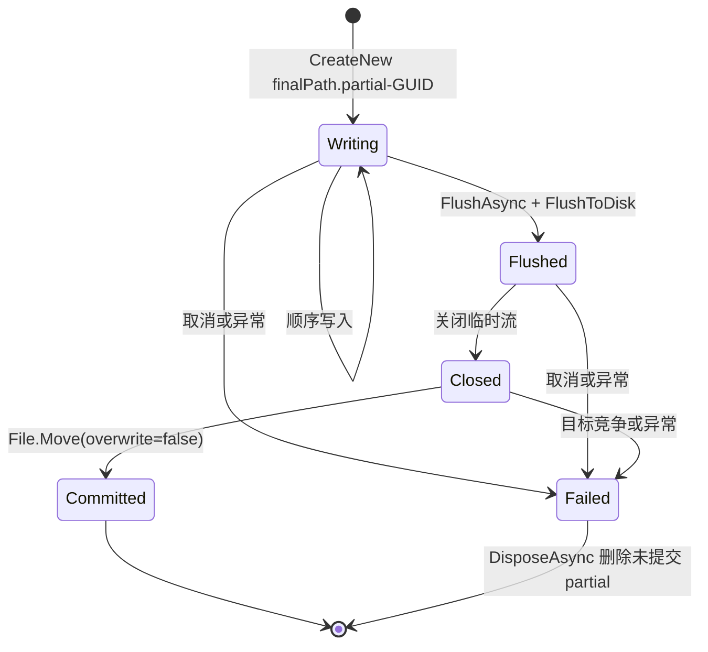
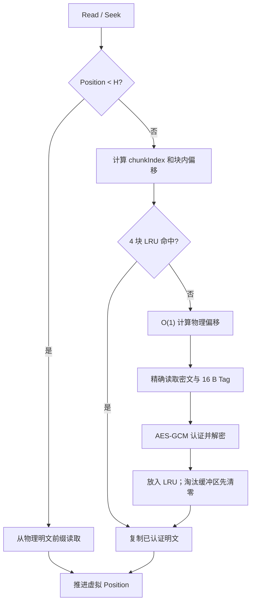

# SECVID03 文件格式与随机读取

## 1. 格式状态

SECVID03 是当前安全视频子系统唯一支持的加密容器。磁盘格式已经冻结：

| 常量 | 当前值 |
| --- | ---: |
| ASCII 魔数 | `SECVID03` |
| 格式版本 | `3` |
| 固定头 | `256` 字节 |
| 公开区 | `65,536` 字节 |
| 原视频前缀上限 | `40` 字节 |
| 明文块大小 | `1,048,576` 字节（1 MiB） |
| GCM Tag | `16` 字节 |
| PBKDF2 迭代次数 | `600,000` |
| 派生密钥 | `32` 字节（AES-256） |

G3.1 的异步播放和 G4 的部署探针、发布 Manifest、ZIP、验收报告均位于容器之外，没有改变任何 SECVID03 常量。

需要修改布局、KDF、块大小、nonce、AAD 或公开区语义时，必须定义新魔数/新版本和独立迁移方案，不能放宽 SECVID03 解析器来“兼容”新格式。

## 2. 设计性质与安全边界

SECVID03 提供：

- PBKDF2-HMAC-SHA256 密钥派生；
- AES-256-GCM 机密性和完整性；
- 固定头与原视频明文前缀的整体认证；
- 视频主体逐块独立加密、认证和 O(1) 物理定位；
- 无需密码的公开文件名、标题和描述；
- 标题和描述的固定区域原地更新；
- 打开时验证密码与不可变头，读取时延迟验证具体视频块。

认证边界：

| 区域/字段 | 明文可见 | 加密 | 密码学认证 | 可原地修改 |
| --- | --- | --- | --- | --- |
| 256 B 固定头（Tag 槽除外） | 是 | 否 | 是，作为固定头 AAD | 否 |
| 原视频前缀 | 是 | 否 | 是，作为固定头 AAD | 否 |
| 视频主体块 | 否 | 是 | 是，每块独立 Tag | 否 |
| 64 KiB 公开区 | 是 | 否 | 否；只有 CRC32 | 标题、描述可修改 |

因此 CRC 正确不表示公开元数据可信。任何拥有文件写权限的人都能修改标题、描述或公开原始文件名并重新计算 CRC；固定头中的原始扩展名和原始长度仍受 GCM 认证。

## 3. 字节序约定

- 固定头和公开区中的整数使用 Little Endian。
- nonce 尾部 32 位计数器使用 Big Endian。
- 视频块 AAD 中的 64 位块序号使用 Big Endian。
- 所有字符串使用无 BOM 的严格 UTF-8；非法 UTF-8 和未配对代理项被拒绝。

## 4. 整体磁盘布局

设：

- `H`：原视频前缀长度，范围 `0..40`；
- `L`：原视频总长度；
- `B = L - H`：需加密的视频主体长度；
- `C = 1,048,576`：块大小；
- `N = B == 0 ? 0 : 1 + (B - 1) / C`：块数。

`N` 最大为 `uint.MaxValue`，因为 nonce 计数器 0 由固定头占用，视频块使用 `1..uint.MaxValue`。

```text
物理偏移 0
├─ 256 B        固定头
├─ 65,536 B     公开信息区（PUBMETA1）
├─ H B          原视频前缀（明文、已认证）
├─ ≤ 1 MiB      第 0 块密文
├─ 16 B         第 0 块 GCM Tag
├─ ≤ 1 MiB      第 1 块密文
├─ 16 B         第 1 块 GCM Tag
│  ...
├─ ≤ 1 MiB      第 N-1 块密文
└─ 16 B         第 N-1 块 GCM Tag
```

关键公式：

```text
OriginalHeaderOffset = 256 + 65,536 = 65,792
EncryptedDataOffset  = 65,792 + H
PhysicalFileLength   = EncryptedDataOffset + B + N × 16

ChunkPhysicalOffset(i)
    = EncryptedDataOffset + i × (1,048,576 + 16)
```

最后一块可以短于 1 MiB，但它之前的块必然是完整块，所以物理偏移公式对尾块仍成立。

空文件也是合法边界：`H=0`、`B=0`、`N=0`，物理长度为 `65,792` 字节。

所有长度、乘法、加法和 Seek 计算使用 `checked`。解析器从 `L` 和 `H` 重新计算 `B`、偏移、块数和精确物理长度，不信任文件中声明的派生值；截断、尾随字节、整数溢出和 nonce 范围溢出均被拒绝。

## 5. 256 字节固定头

| 字节范围 | 长度 | 类型/字节序 | 内容 |
| --- | ---: | --- | --- |
| `0..7` | 8 | ASCII | `SECVID03` |
| `8..11` | 4 | Int32 LE | 版本 `3` |
| `12..15` | 4 | Int32 LE | 固定头长度 `256` |
| `16..23` | 8 | Int64 LE | 公开区偏移 `256` |
| `24..27` | 4 | Int32 LE | 公开区容量 `65,536` |
| `28..31` | 4 | Int32 LE | 原视频前缀长度 `H` |
| `32..39` | 8 | Int64 LE | 原视频总长度 `L` |
| `40..47` | 8 | Int64 LE | 主体长度 `B` |
| `48..55` | 8 | Int64 LE | `EncryptedDataOffset` |
| `56..59` | 4 | Int32 LE | 块大小 `1,048,576` |
| `60..63` | 4 | Int32 LE | Tag 长度 `16` |
| `64..67` | 4 | Int32 LE | PBKDF2 迭代数 `600,000` |
| `68..71` | 4 | bytes | 保留，必须全零 |
| `72..87` | 16 | bytes | 每文件随机 salt |
| `88..103` | 16 | bytes | 每文件随机 `fileId` |
| `104..111` | 8 | bytes | 每文件随机 `noncePrefix` |
| `112..115` | 4 | Int32 LE | 原扩展名 UTF-8 字节数 |
| `116..147` | 32 | UTF-8 + zero padding | 原扩展名槽位 |
| `148..163` | 16 | bytes | 固定头 AES-GCM Tag |
| `164..255` | 92 | bytes | 保留，必须全零 |

写入器当前把 `Path.GetExtension(inputPath).ToLowerInvariant()` 写入原扩展名，因此通常包含前导点，例如 `.mp4`。格式解析本身只要求严格 UTF-8、长度不超过 32 字节且槽位剩余部分为零。

`fileId` 是每文件随机标识，当前不参与路径或库索引；它位于固定头中，因而属于认证数据。

### 5.1 结构验证顺序

读取端在高成本 PBKDF2 前完成：

1. 精确读取 256 字节；
2. 检查魔数；
3. 检查版本、固定长度、公开区偏移/容量、块大小、Tag 和 KDF 常量；
4. 检查长度范围、扩展名长度和所有保留/填充字节；
5. 严格解码扩展名；
6. 重新计算布局、块数和物理文件长度；
7. 结构通过后读取原视频前缀；
8. 最后派生密钥并验证固定头 Tag。

这样可防止恶意长度在 PBKDF2、分配或 Slice 前触发高成本操作、超大内存或越界。

## 6. 密钥、nonce 与 AAD

### 6.1 密钥派生

```text
key = PBKDF2-HMAC-SHA256(
    password,
    salt = fixedHeader[72..87],
    iterations = 600,000,
    outputLength = 32)
```

密码及其可直接比较的 hash 不写入文件。UI 当前要求密码至少 6 个字符，这只是输入下限，不是强密码保证。

认证上下文持有派生密钥和不可变头摘要；Dispose 时使用 `CryptographicOperations.ZeroMemory` 清零二者。

### 6.2 nonce

每个 nonce 为 12 字节：

```text
[ noncePrefix: 8 B ][ counter: UInt32 BE ]
```

| 用途 | counter |
| --- | ---: |
| 固定头认证 | `0` |
| 视频块 `i` | `i + 1` |

同一文件内不会重复 counter；解析器拒绝超过 `uint.MaxValue` 个视频块。

### 6.3 固定头认证

固定头 Tag 使用空明文和以下 AAD：

```text
fixedHeaderAad =
    fixedHeader[0..255]（先把 148..163 Tag 槽清零）
    || originalHeaderPrefix
```

```text
headerTag = AES-256-GCM(
    key,
    nonce(counter=0),
    plaintext = empty,
    aad = fixedHeaderAad)
```

密码错误、固定头任意已接受字段变化或原视频前缀变化都会导致认证失败。`SeekableEncryptedVideoStream.Open` 将该失败公开为：

```text
UnauthorizedAccessException("密码错误或文件已损坏。")
```

结构无效则仍是 `InvalidDataException`，不会伪装成密码错误。

### 6.4 视频块认证

打开成功后先计算：

```text
immutableDigest = SHA256(fixedHeaderAad)
chunkAad(i) = immutableDigest || Int64BigEndian(i)
```

块 `i` 使用：

```text
nonce = noncePrefix || UInt32BigEndian(i + 1)
aad   = immutableDigest || Int64BigEndian(i)
tag   = 紧跟该块密文后的 16 B
```

块序号进入 AAD，因此同一文件内交换块、把块复制到另一文件或修改 Tag 都会失败。底层解密失败先清零目标明文缓冲区；随机读取流再抛出：

```text
InvalidDataException("密码错误或文件已损坏。")
```

在 Tag 验证成功前，不会把该块的任何明文返回给调用方或 LibVLC。

## 7. 原视频前缀

原视频前缀以明文存放，使解码器在虚拟流偏移 0 看到常见容器签名；它同时进入固定头 AAD，所以不可修改。

当前检测规则：

| 特征 | 返回长度上限 |
| --- | ---: |
| MP4：偏移 4 为 `ftyp` | 32 B |
| AVI：偏移 8 为 `AVI ` | 12 B |
| Matroska/WebM：开头为 `1A 45 DF A3` | 40 B |
| FLV：开头为 `FLV` | 9 B |
| 其他格式 | 32 B |

检测最多读取 40 字节，并在结束后恢复输入流原 Position。短于 9 字节的文件全部作为前缀；其他短文件返回实际可读长度，不会虚构字节。

## 8. 64 KiB 公开信息区

公开区相对固定头偏移为 256，固定容量为 65,536 字节。

| 相对字节范围 | 长度 | 类型/字节序 | 内容 |
| --- | ---: | --- | --- |
| `0..7` | 8 | ASCII | `PUBMETA1` |
| `8..11` | 4 | Int32 LE | 公开区版本 `1` |
| `12..15` | 4 | Int32 LE | 记录总长度 |
| `16..19` | 4 | Int32 LE | 原始文件名 UTF-8 字节数 |
| `20..23` | 4 | Int32 LE | 标题 UTF-8 字节数 |
| `24..27` | 4 | Int32 LE | 描述 UTF-8 字节数 |
| `28..31` | 4 | UInt32 LE | 负载 CRC32 |
| `32..totalLength-1` | 可变 | UTF-8 | 文件名、标题、描述连续负载 |
| `totalLength..65,535` | 可变 | bytes | 必须全零 |

CRC 使用标准 CRC-32/ISO-HDLC 多项式，覆盖范围仅为：

```text
publicRegion[32..totalLength)
```

CRC 不覆盖 32 字节记录头，也不覆盖尾部零填充。

### 8.1 文本限制

| 字段 | Unicode Rune 上限 | UTF-8 字节上限 | 公开更新 API 可改 |
| --- | ---: | ---: | --- |
| 原始文件名 | 255 | 1,020 | 否 |
| 标题 | 200 | 800 | 是 |
| 描述 | 10,000 | 40,000 | 是 |

计数单位是 Unicode 标量值（`Rune`），不是 UTF-16 `char`。常见 emoji 虽占两个 `char`，仍计一个 Rune。

文本规则：

- 拒绝未配对代理项和非法 UTF-8；
- 拒绝 NUL；
- 拒绝普通控制字符；
- 允许 `\r`、`\n`、`\t`；
- 三段长度之和必须精确等于记录总长度；
- 记录末尾至 64 KiB 的所有字节必须为零。

### 8.2 读取失败与播放的关系

公开区解析失败不会改变固定头或块认证。UI 可以回退显示容器文件名并提示公开信息不可读，用户仍可输入密码尝试播放。

`EncryptedVideoContainer.ReadPublicInfo` 仍会先严格解析固定头和精确物理长度，所以“公开区可读”不等于忽略容器结构。

### 8.3 原地更新协议

`UpdatePublicInfo` 只更新标题和描述，并保留现有公开原始文件名：

1. 以读写方式打开文件；
2. 解析固定头和当前公开区；
3. 在内存中构造完整 64 KiB 新镜像；
4. 写 `publicRegion[32..65,536)`（新负载和零填充）；
5. `Flush(flushToDisk:true)`；
6. 最后写 `publicRegion[0..32)`（新记录头和 CRC）；
7. 再次 `Flush(flushToDisk:true)`。

若进程在步骤 5 后退出，旧头与新负载不匹配，读取端会检测到 CRC 或长度错误。这个顺序提供“可检测的中断”，不提供多版本回滚或恶意篡改防护。

播放中的 FileStream 共享模式不允许并发写入，因此页面编辑前必须先完整 Release 当前媒体。

## 9. 事务式文件生成

加密和明文导出共用 `OutputFileTransaction`：



临时文件与正式目标位于同一目录。预检后发生同名竞争时，`File.Move(..., overwrite:false)` 返回 `OutputConflict`，不会覆盖现有文件。

加密时写入顺序为固定头、公开区、原视频前缀、每块密文和 Tag。错误密码的批量解密在创建明文事务前失败；块篡改、取消、磁盘错误或提交竞争由事务清理当前 partial，已提交文件不回滚。

## 10. 随机读取流

`SeekableEncryptedVideoStream` 向调用者呈现与原视频长度和内容一致的只读 Stream：



实现特征：

- Open 只认证不可变头，不预读视频块。
- Stream 支持同步 `Read`、`Seek` 和 Position，禁止写入。
- Stream 自身不承诺多线程安全。
- 预分配 4 个 1 MiB 明文缓冲区和 1 个 1 MiB 密文缓冲区。
- LRU 淘汰、异常和 Dispose 会清零明文缓冲区。
- FileStream 在 Dispose 时关闭，随后清零缓存和认证上下文。
- 打开后文件被截断时，精确读取抛出 `EndOfStreamException`。

`SeekableStreamMediaInput` 在其外层：

- 用锁串行化 Open/Read/Seek/Close；
- 把单次 Read 限制为最多 1 MiB；
- 检查 `ulong` 到 `.NET long` 的转换和范围；
- 拥有传入 Stream 的生命周期；
- Dispose 时清零桥接缓冲区；
- 用 `RequestStop` 使原生读取尽快退出。

## 11. 解析与错误分类

| 场景 | 容器层表现 | 上层稳定分类 |
| --- | --- | --- |
| 魔数/版本/常量/长度/UTF-8/零填充无效 | `InvalidDataException` | `InvalidFormat` |
| 密码错误或不可变头/前缀认证失败 | `UnauthorizedAccessException` | `AuthenticationFailed` |
| 已读取块密文或 Tag 认证失败 | `InvalidDataException` | `CorruptedContent` |
| 公开区 CRC/长度/文本无效 | `InvalidDataException`，不阻断固定头认证 | UI 回退公开信息；仍可尝试播放 |
| 文件打开后被截断 | `EndOfStreamException` | 输入不可用或内容损坏 |
| Seek 超出虚拟原视频范围 | `IOException`/范围异常 | `InvalidRequest` 或读取失败 |

界面和验收报告应依赖稳定失败代码，不根据底层异常文本推断类型。

## 12. 格式兼容规则

- 只接受精确魔数 `SECVID03` 和版本 `3`。
- 固定头声明值必须与冻结常量一致。
- 保留区、扩展名剩余槽和公开区尾部必须为零。
- 物理文件长度必须精确匹配，不接受尾随数据。
- 不探测或读取旧容器，不自动迁移。
- 不把发布 Manifest、部署问题、播放状态或媒体索引写入容器。
- 新需求若改变认证边界，必须设计新格式，而不是复用未认证公开区承载安全数据。

## 13. 固定向量与验证

固定向量位于：

```text
Plugins/VideoSecurityPlayer/VideoSecurityPlayer.Tests/TestAssets/Secvid03Vectors/v1/
├─ g1-vector.mp4
├─ g1-vector.secvid
└─ manifest.json
```

这里目录/Manifest 的 `v1`/`schemaVersion: 1` 是测试向量清单版本，不是 SECVID 格式版本；容器本身仍是 SECVID03、版本 3。

固定向量覆盖：

- 固定 salt、fileId 和 noncePrefix；
- 32 字节 MP4 前缀；
- 一个完整 1 MiB 块和 17 字节尾块；
- 固定头字节串、容器/明文 SHA-256；
- 每块物理偏移、nonce、AAD 和 Tag；
- 当前写入器、当前读取器和独立参考实现三方一致性。

常用验证命令（从仓库根目录执行）：

```powershell
dotnet test .\Plugins\VideoSecurityPlayer\VideoSecurityPlayer.Tests\VideoSecurityPlayer.Tests.csproj -c Release --filter "FullyQualifiedName~Secvid03"
```

不要在普通测试中设置 `SECVID03_REGENERATE_VECTOR_DIR`。只有明确审查格式向量变更时，才可生成到独立目录并人工比较；SECVID03 冻结后，正常代码调整不应改变已提交向量。

## 14. 对应实现与测试

- [Secvid03Format.cs](../../../src/VideoSecurityPlayer.Plugin/Business/SecretVideoPlayer/Container/Secvid03Format.cs)：格式常量、布局计算、前缀检测和严格解析。
- [Secvid03Cryptography.cs](../../../src/VideoSecurityPlayer.Plugin/Business/SecretVideoPlayer/Container/Secvid03Cryptography.cs)：KDF、nonce、AAD、固定头和块认证。
- [EncryptedVideoContainer.cs](../../../src/VideoSecurityPlayer.Plugin/Business/SecretVideoPlayer/Container/EncryptedVideoContainer.cs)：公开区编码、CRC、读取和原地更新。
- [Secvid03Encryptor.cs](../../../src/VideoSecurityPlayer.Plugin/Business/SecretVideoPlayer/Encryption/Secvid03Encryptor.cs)：流式写入。
- [Secvid03Decryptor.cs](../../../src/VideoSecurityPlayer.Plugin/Business/SecretVideoPlayer/Decryption/Secvid03Decryptor.cs)：逐块认证导出。
- [OutputFileTransaction.cs](../../../src/VideoSecurityPlayer.Plugin/Business/SecretVideoPlayer/Operations/OutputFileTransaction.cs)：partial、落盘和不覆盖提交。
- [SeekableEncryptedVideoStream.cs](../../../src/VideoSecurityPlayer.Plugin/Business/SecretVideoPlayer/Container/SeekableEncryptedVideoStream.cs)：按需认证解密与 LRU。
- [SeekableStreamMediaInput.cs](../../../src/VideoSecurityPlayer.Plugin/Business/SecretVideoPlayer/Playback/SeekableStreamMediaInput.cs)：LibVLC Stream 回调适配。
- [Secvid03SecurityTests.cs](../../../tests/VideoSecurityPlayer.Tests/Secvid03SecurityTests.cs)：结构边界、逐字节篡改、块归属、清零和路径安全。
- [Secvid03GoldenVectorTests.cs](../../../tests/VideoSecurityPlayer.Tests/Secvid03GoldenVectorTests.cs)：固定向量与独立参考验证。
- [Secvid03Tests.cs](../../../tests/VideoSecurityPlayer.Tests/Secvid03Tests.cs)：端到端加密、公开信息和随机读取。
