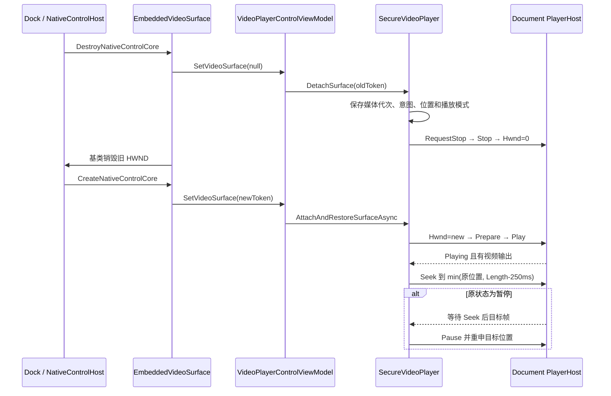

# LibVLC 接入、开发约定与故障排查

本文记录 `VideoSecurityPlayer` 安全视频子系统与插件宿主、LibVLC、Avalonia `NativeControlHost`、Dock 和发布流程之间的当前约束。这里的顺序和目录规则均有生产代码或回归门禁支撑；修改前应同时更新对应测试和专题文档。

## 1. 当前支持矩阵

| 项目 | 当前值 |
| --- | --- |
| 运行平台 | Windows x64 |
| 目标框架 | `net10.0`；真实窗口 Harness 为 `net10.0-windows` |
| LibVLCSharp | `3.10.0` |
| LibVLCSharp.Avalonia | `3.10.0` |
| VideoLAN.LibVLC.Windows | `3.0.23.1` |
| 原生私有目录 | `Controls/SmallTools/native/win-x64/libvlc/` |
| 正式发布入口 | `scripts/Release-VideoSecurityPlayerP0.ps1` |

不允许自动回退到系统 VLC、`PATH`、进程工作目录或宿主根目录。

## 2. 构建部署与正式发布包

### 2.1 构建后的插件目录

根级 Managed Plugin Target 根据 `VideoSecurityPlayer.csproj` 的声明式资产，在构建后重新创建当前插件目录：

```text
Host/MyAvaloniaManagement/bin/<Configuration>/net10.0/
└─ Controls/SmallTools/
   ├─ VideoSecurityPlayer.Plugin.dll
   ├─ VideoSecurityPlayer.deps.json
   ├─ VideoSecurityPlayer.pdb
   ├─ plugin.manifest.json
   ├─ LibVLCSharp.dll
   ├─ LibVLCSharp.Avalonia.dll
   └─ native/win-x64/libvlc/
      ├─ libvlc.dll
      ├─ libvlccore.dll
      └─ plugins/
```

公共 Target 只删除并重建 `Controls/SmallTools/`，防止升级 LibVLC 后遗留旧模块形成混合版本，
不会修改兄弟插件。`VideoLAN.LibVLC.Windows` 设置 `PrivateAssets="all"`，并通过
`VlcWindowsX64TargetDir` 把 NuGet 原生内容重定向到插件私有目录。

设置 `SkipPluginDeploy=true` 只会跳过向宿主输出复制，不会产生可直接分发的发布包。测试和辅助工程使用此属性避免彼此争用宿主部署目录。

### 2.2 正式 ZIP 布局

正式发布脚本调用 G12 单插件打包入口，ZIP 内沿用宿主严格清单：

```text
Controls/SmallTools/
├─ VideoSecurityPlayer.Plugin.dll
├─ VideoSecurityPlayer.deps.json
├─ VideoSecurityPlayer.pdb
├─ LibVLCSharp.dll
├─ LibVLCSharp.Avalonia.dll
├─ plugin.manifest.json
└─ native/win-x64/libvlc/...
```

同名外置 `VideoSecurityPlayer-<PluginVersion>-win-x64.manifest.json` 记录 ZIP 摘要，以及每个 ZIP 文件的
完整 `Controls/SmallTools/...` 路径、长度和 SHA-256。ZIP 从 `Controls/SmallTools/` 开始，可解压到
宿主根目录；通用入口按稳定路径排序并固定时间戳，再从最终 ZIP 复验摘要。专项脚本随后只负责生产部署探针。

## 3. LibVLC 初始化与部署探针

### 3.1 初始化顺序

正确顺序是：

1. 以 `VideoSecurityPlayer.Plugin.dll` 的 `Assembly.Location` 确定插件绝对目录。
2. 组合 `native/win-x64/libvlc`。
3. `IPlaybackDeploymentProbe.Check()` 无副作用地收集全部问题。
4. 只有 `DeploymentCheckResult.IsReady` 为 `true` 时，才调用 `LibVlcRuntime.EnsureInitialized()`。
5. `LibVlcRuntime` 调用一次 `Core.Initialize(runtimeDirectory)`。
6. 初始化成功后才创建 Document 级 `LibVLC` 和 `MediaPlayer`。

`LibVlcRuntime` 是进程级 Singleton，并使用双重检查锁。`LazyPlaybackBackend` 是 Document scoped：部署失败时不创建原生对象；部署通过时，`VideoPlayerControlViewModel` 在 `VideoView` 首次绑定前调用 `IPlaybackBackendInitializer.Initialize()`，以保持真实 HWND 门禁验证过的创建顺序。

### 3.2 探针检查内容

`PlaybackDeploymentProbe` 当前检查：

- Windows 操作系统和 x64 进程；
- 插件目录是否存在；
- `LibVLCSharp.dll`、`LibVLCSharp.Avalonia.dll` 是否存在且程序集名正确；
- `libvlc.dll`、`libvlccore.dll` 是否为有效 AMD64 PE；
- `plugins/demux/libmp4_plugin.dll`；
- `plugins/demux/libmkv_plugin.dll`；
- `plugins/codec/libavcodec_plugin.dll`；
- `plugins/video_output/libdirect3d11_plugin.dll`；
- `plugins/audio_output/libmmdevice_plugin.dll`。

探针不会加载 DLL，也不会调用原生 API。它返回所有可识别问题，而不是只返回第一项。UI 必须展示稳定问题码、检查路径和建议操作。

若 `Core.Initialize` 失败，会映射为 `NativeInitializationFailed`。用户重新部署后必须重启宿主；进程内已经发生的原生加载状态不做回滚。

## 4. 插件扫描必须排除原生目录

宿主递归扫描托管插件 DLL，但 LibVLC `plugins/` 下是原生 DLL。首次扫描和 `PluginLoadContext` 依赖解析必须使用同一排除规则：

```text
遇到目录名 native、runtimes 或 libvlc（大小写不敏感）时停止递归
```

只修首次扫描不够。托管依赖缺失时，解析器也可能进入原生树并把原生 DLL 交给 `AssemblyLoadContext`。

`NativeDirectoryScanTests.PluginScannerAndResolver_DoNotEnterNativeDirectory` 使用目录名和嵌套深度参数矩阵验证扫描器与解析器都不会发现原生树中的可加载测试程序集。

## 5. 媒体切换、资源所有权与文件句柄

### 5.1 当前资源模型

G3.1 后不再使用“一个媒体 Lease 同时拥有 MediaPlayer”的模型。当前所有权为：

```text
Document Scope
├─ LazyPlaybackBackend
│  └─ LibVlcDocumentPlayerHost
│     ├─ LibVLC
│     └─ MediaPlayer
├─ SecureVideoPlayer
│  └─ 当前 IPlaybackMediaSource
│     ├─ Media
│     └─ SeekableStreamMediaInput
│        └─ SeekableEncryptedVideoStream
│           ├─ FileStream
│           ├─ 4 块明文缓存
│           └─ 密钥/摘要上下文
├─ PlaybackNativeDispatcher
└─ PlaybackResourceReaper
```

媒体切换只替换 Source，不重建 Document 级 PlayerHost。候选 Source 先在后台完成 SECVID03 认证和 LibVLC Parse；失败时旧媒体保持不变。

### 5.2 提交与释放顺序

候选提交的原生顺序：

```text
oldSource.RequestStop()
→ MediaPlayer.Stop()
→ MediaPlayer.Media = null
→ MediaPlayer.Media = candidate.Media
→ 可选 Play()
```

Attach 或启动失败时，播放会话尝试重新挂载旧 Source。提交成功后，旧 Source 才进入有界回收器。

单 Source 的释放顺序：

```text
MediaInput.RequestStop()
→ Media.Dispose()
→ MediaInput.Dispose()
→ SeekableEncryptedVideoStream.Dispose()
→ FileStream 关闭
→ 明文/密文桥接缓存、派生密钥和摘要清零
```

不能先关闭底层流；LibVLC 仍可能从原生线程执行回调。Source 也不能在仍挂载到 `MediaPlayer` 时交给 Reaper。

`PlaybackResourceReaper` 是 Document 级、容量为 1 的有界单消费者。快速换片时它提供背压，不为每次点击创建无界后台释放任务。

### 5.3 编辑、删除或移动当前文件

Pause 和 Stop 都不会保证文件句柄已关闭。要修改公开信息、删除或移动当前 `.secvid`，必须调用 `ReleaseAsync`/`CleanupMediaAsync`。显式 Release 会等待 Reaper 真正完成释放，然后才返回成功。

如果另一个 Dock Document 正在播放同一个文件，它仍可合法持有自己的读取句柄；当前 Document 的 Release 不能替另一个 Scope 释放资源。

## 6. 原生回调与线程约定

- PBKDF2、容器打开和 `Media.Parse` 在后台执行。
- `MediaPlayer` 的 Play、Pause、Stop、Seek、挂载和解绑由 `PlaybackNativeDispatcher` 单消费者串行执行。
- `SeekableStreamMediaInput` 用一把锁串行 Open/Read/Seek/Close，因为底层 Stream 的 Position 是共享状态。
- 单次原生 Read 最多分配/复用 1 MiB 托管缓冲区。
- LibVLC 回调边界不得抛出托管异常；Read 失败返回 `-1`，Seek 失败返回 `false`。
- `SeekableStreamMediaInput` 保存首个类型化失败，并在回调锁释放后投递失败事件；禁止从 Read 回调内部直接调用 `MediaPlayer.Stop()`。
- UI 绑定更新统一通过 `Dispatcher.UIThread`。
- `DetachSurface` 是同步例外，因为旧 HWND 返回销毁调用前必须停止旧 vout。

## 7. Dock 切换与视频表面恢复

### 7.1 原生句柄绑定

`EmbeddedVideoSurface` 继承 `VideoView`：

- `CreateNativeControlCore` 先调用基类；平台句柄非零后绑定 `MediaPlayer.Hwnd`，再通知 Ready。
- `DestroyNativeControlCore` 在调用基类、即基类清零 Hwnd 之前同步通知 Lost。
- `VideoPlayerControl` 更换 `DataContext` 时，先让旧 ViewModel 失去表面，再切换 `MediaPlayer`，最后把当前表面交给新 ViewModel。

Lost 通知不能异步 Post。旧 vout 如果在 HWND 已销毁后仍工作，可能黑屏、弹出独立输出窗口或触发原生崩溃。

### 7.2 恢复时序



恢复使用表面代次、媒体代次、用户意图代次、一次性快照和取消源。Play、Pause、Stop、Seek、换片、清理或再次丢失表面都会使旧恢复失效。等待 vout 或目标帧最多 5 秒。

不能把流程简化为 “Pause → 换 Hwnd → Play”：Pause 不保证旧 vout 退出；暂停恢复时也不能省略 Seek 后首帧等待。

## 8. Document Scope 与 View 约定

### 8.1 四个 Document

当前策略为：

- `SecretVideoDocumentStrategy`：单文件安全视频播放器；
- `SecretVideoLibraryDocumentStrategy`：文件夹媒体库；
- `VideoEncryptorDocumentStrategy`：视频加密器；
- `VideoDecryptorDocumentStrategy`：批量解密器。

所有策略都通过 `IDocumentScopeFactory` 创建 Document。`DocumentScopeManager` 保存 `Document → IServiceScope`，Dock 真正确认关闭后才释放 Scope。

ViewModel 可以取消自己发起的任务、退订事件和淘汰迟到回调，但不得再次 Dispose 同样由 Scope 拥有的注入服务。任务 Document 关闭时只发送取消，不在 UI 线程同步等待。

G7.1 后，顶层 Document ViewModel 是宿主兼容外壳，实际实现按
`Playback/Library/Encryption/Decryption/SingleVideo` 功能包组织。兼容代理必须指向同一个
状态所有者，禁止为了旧绑定再复制一份密码、进度、队列或列表投影。

### 8.2 文件选择器

文件/文件夹选择依赖 `TopLevel.StorageProvider`，因此保留在 View 点击处理器中。异步处理器必须：

- 防止同一 View 重入打开多个选择器；
- 保存发起请求时的 ViewModel；
- 返回后确认当前 `DataContext` 仍是发起者；
- 在任务执行期间禁止替换输入；
- 只接受本地路径，并把安全错误写回当前 Document。

不要改成 ViewModel 事件订阅，否则 Dock 重建 View 或重复设置 `DataContext` 时容易累计订阅。
文件/目录选择器位于实际功能子 View；顶层 View 不再集中处理其他组件的窗口级交互。

### 8.3 UI 命名

- `Document.Title` 是 Dock 标签标题。
- SECVID03 公开 `Title` 是视频业务标题。
- 清空表单或修改公开标题不得修改 `Document.Title`。
- 公开标题为空时回退到公开原始文件名；公开区不可读时回退到 `.secvid` 容器文件名。
- 解密输出名必须经 `DecryptionOutputPathResolver` 净化，不能直接信任公开文件名并 `Path.Combine`。

## 9. 加解密预检与输出约定

- 加密输出目录可按当前产品行为创建；批量解密目录必须已存在。
- 可写检查通过创建、关闭并删除唯一探针文件完成，不只检查 ACL 属性。
- 已知剩余空间不足是阻止项；无法可靠读取网络目录空间是警告。
- 加密目标存在时阻止；解密输出使用安全数字后缀避让磁盘和批次内冲突。
- 执行入口必须重新检查关键条件。
- 密码认证不在普通预检中重复执行，但必须早于明文 partial 创建。
- 最终提交始终使用 `File.Move(..., overwrite:false)`。
- ViewModel 显示稳定失败代码和脱敏消息，不直接展示未知异常的原始 `Message`。

## 10. 正式发布门禁

从仓库根目录运行：

```powershell
.\scripts\Release-VideoSecurityPlayerP0.ps1
```

默认门禁按顺序执行：

1. Windows x64 与 .NET 10 SDK 检查；
2. 拒绝 dirty worktree；
3. VideoSecurityPlayer Release 构建，警告即失败；
4. `VideoSecurityPlayer.Tests`；
5. 宿主插件测试；
6. ReleaseAcceptance 构建；
7. 调用 G12 单插件入口生成严格清单、稳定 ZIP 和外置文件清单；
8. 解压已由通用入口复验的最终 ZIP；
9. 对解压目录运行生产部署探针；
10. 64 MiB/512 MiB 流式内存门禁；
11. 两轮真实窗口播放与 Dock 门禁；
12. 写出验收 JSON。

输出目录：

```text
artifacts/VideoSecurityPlayer/p0-win-x64/
├─ VideoSecurityPlayer-<PluginVersion>-win-x64.zip
├─ VideoSecurityPlayer-<PluginVersion>-win-x64.manifest.json
├─ VideoSecurityPlayer-<PluginVersion>-win-x64.acceptance.json
├─ deployment-probe.json
├─ memory-gate.json
├─ playback-run1.json
└─ playback-run2.json
```

`-AllowDirty` 只用于开发验证，`publishable` 为 `false`。`-SkipPlaybackGate` 或改变默认内存规模同样不会产生可发布验收结果。

## 11. 故障排查

### 11.1 播放器部署不可用

1. 记录 UI 中的所有稳定问题码、检查路径和建议。
2. 不要先安装系统 VLC，也不要修改 `PATH`。
3. 删除旧 `Controls/SmallTools/` 后解压完整 ZIP，避免混合版本。
4. 在播放页点击“重新检测”。
5. 若出现 `NativeInitializationFailed`，重新部署后重启宿主。

### 11.2 密码正确但加载失败

1. 确认输入魔数和结构是严格 SECVID03。
2. 打开阶段失败通常属于结构、固定头、密码或前缀认证。
3. 播放到特定位置才失败通常属于对应密文块或 Tag 损坏。
4. 公开区 CRC 损坏不会单独阻止密码验证。
5. 不要手工修正固定头长度、偏移或保留位；这些字段属于认证数据。

### 11.3 Dock 切回后黑屏

1. 确认当前输出仍是内嵌 HWND，没有独立 Direct3D11 窗口。
2. 确认非零句柄创建后才设置 Hwnd。
3. 确认 Lost 在基类销毁前同步执行 Stop 和 Hwnd 清零。
4. 暂停恢复顺序必须包含 Play、等待 vout、Seek、等待目标帧、Pause。
5. 检查是否出现 5 秒恢复超时。
6. 快速切换时确认旧表面/媒体代次被丢弃。

### 11.4 文件仍被占用

1. 调用 `CleanupMediaAsync`/`ReleaseAsync`，不要只 Pause 或 Stop。
2. 检查 Source 是否先从 Host 解绑，再进入 Reaper。
3. 检查另一个 Document 是否仍播放同一文件。
4. 用重复 Open/Read/Dispose 测试确认容器流没有遗留句柄。

### 11.5 遗留 `.partial-*`

1. 确认对应 Document Scope 已释放并触发取消。
2. 确认后台任务观察到取消并离开加密/解密循环。
3. 检查临时文件是否被外部进程占用。
4. 检查 `CleanupFailed`；不要在 UI Dispose 中同步等待任务。

## 12. 维护检查表

### 修改 SECVID03

- [ ] 保持固定偏移、块大小、Tag 长度、KDF、nonce 和 AAD；否则定义新格式。
- [ ] 外部长度在 Slice、分配和偏移计算前完成范围及溢出检查。
- [ ] 只返回已认证明文，并在异常、淘汰和 Dispose 时清零敏感缓冲区。
- [ ] 更新安全、固定向量、顺序读取、跨块 Seek 和篡改测试。

### 修改 LibVLC、部署或发布

- [ ] 托管桥接和原生版本经过成套验证。
- [ ] `Core.Initialize` 仍早于任何 `new LibVLC()`。
- [ ] 探针仍无副作用并聚合全部问题。
- [ ] 发布包不依赖系统 VLC，且原生树仍排除在插件扫描之外。
- [ ] 更新 Manifest/ZIP/部署探针和两轮真实窗口门禁。

### 修改播放或 Dock

- [ ] 一个 Document 仍只创建一个 PlayerHost。
- [ ] 候选验证失败不破坏旧媒体，提交失败可回滚。
- [ ] Source 解绑后才释放，回收队列保持有界。
- [ ] 普通原生命令不在 UI 线程执行。
- [ ] Lost 同步屏障和完整恢复顺序仍成立。
- [ ] 用户操作、媒体/表面代次和 Document 关闭能淘汰旧异步结果。

### 修改 DI 或任务关闭

- [ ] 四类 Document 仍各自使用独立 Scope。
- [ ] 每个可释放资源只有一个最终所有者。
- [ ] 迟到 UI 回调在 Dispose 或代次变化后失效。
- [ ] 取消会清理当前 partial，不回滚已提交结果，不阻塞 UI 线程。

## 13. 代码、测试与文档映射

| 能力 | 生产入口 | 自动化证据 | 说明 |
| --- | --- | --- | --- |
| SECVID03 格式与认证 | `Secvid03Format`、`Secvid03Cryptography` | `Secvid03SecurityTests`、`Secvid03GoldenVectorTests` | [格式说明](../reference/secvid03-format.md) |
| 加密/解密与输出事务 | `Secvid03Encryptor`、`Secvid03Decryptor`、`OutputFileTransaction` | `Secvid03Tests`、`VideoDecryptionTests`、`G2ReliabilityTests` | [架构](../design/architecture-design.md) |
| 候选换片与单 PlayerHost | `SecureVideoPlayer`、`PlaybackBackend`、`PlaybackMediaLease.cs` 中的 Source/Host | `G3PlaybackSessionTests` | [G3.1](../plan-history/G3.1-ASYNC-PLAYBACK-UI-RESPONSIVENESS.md) |
| HWND/Dock 恢复 | `EmbeddedVideoSurface`、`VideoSurfaceRestoreSequence` | `VideoToolStabilityTests`、真实窗口 Harness | [G3](../plan-history/G3-REAL-MEDIA-PLAYBACK-DOCK-STABILITY.md) |
| 部署探针与发布门禁 | `PlaybackDeploymentProbe`、发布脚本 | `G4DeploymentTests`、`ReleaseAcceptance` | [G4](../plan-history/G4-P0-DEPLOYMENT-ACCEPTANCE-RELEASE-BASELINE.md) |
| 插件扫描排除 | 宿主 `AssemblyLoaderHelper`、`PluginLoadContext` | `NativeDirectoryScanTests` | 本文第 4 节 |
| Document Scope | `DocumentScopeManager`、4 个 Strategy | 宿主插件兼容与 Scope 测试 | [架构](../design/architecture-design.md) |
| 真实 MP4/WebM | 测试资产和 Harness | `RealMediaAssetTests`、真实窗口门禁 | [测试资产](../reference/real-media-test-assets.md) |
| P1 规模与组合 | G8 Harness 套件、P1 串行脚本 | `G8P1IntegrationAcceptanceTests`、`G8DocumentScopeIsolationTests` | [G8](../plan-history/G8-P1-INTEGRATION-ACCEPTANCE.md) |

常用验证命令（从仓库根目录执行）：

```powershell
dotnet test .\Plugins\VideoSecurityPlayer\VideoSecurityPlayer.Tests\VideoSecurityPlayer.Tests.csproj -c Release
dotnet test .\Host\MyAvaloniaManagement.PluginTests\MyAvaloniaManagement.PluginTests.csproj -c Release
dotnet run --project .\Plugins\VideoSecurityPlayer\VideoSecurityPlayer.Playback.IntegrationHarness\VideoSecurityPlayer.Playback.IntegrationHarness.csproj -c Release -- --report .\TestResults\manual-playback.json
.\scripts\Accept-VideoSecurityPlayerP1.ps1 -AllowDirty
.\scripts\Accept-VideoSecurityPlayerG10.ps1 -AllowDirty
.\scripts\Accept-VideoSecurityPlayerG11.ps1 -AllowDirty
```

正式 G11 必须从 clean worktree 执行，不带 `-AllowDirty`。完成全部人工交互后再由实际
验收人运行 `Approve-VideoSecurityPlayerG11.ps1`；完整前置条件、命令、预期结果和失败处理见
[G11 最终验收与完整测试手册](../reference/G11-FINAL-ACCEPTANCE-AND-TEST-GUIDE.md)。

## 14. 关键源码

- [VideoSecurityPlayer.csproj](../../../src/VideoSecurityPlayer.Plugin/VideoSecurityPlayer.Plugin.csproj)
- [PlaybackDeployment.cs](../../../src/VideoSecurityPlayer.Plugin/Business/SecretVideoPlayer/Playback/PlaybackDeployment.cs)
- [LibVlcRuntime.cs](../../../src/VideoSecurityPlayer.Plugin/Business/SecretVideoPlayer/Playback/LibVlcRuntime.cs)
- [PlaybackBackend.cs](../../../src/VideoSecurityPlayer.Plugin/Business/SecretVideoPlayer/Playback/PlaybackBackend.cs)
- [SecureVideoPlayer.cs](../../../src/VideoSecurityPlayer.Plugin/Business/SecretVideoPlayer/Playback/SecureVideoPlayer.cs)
- [PlaybackMediaLease.cs](../../../src/VideoSecurityPlayer.Plugin/Business/SecretVideoPlayer/Playback/PlaybackMediaLease.cs)
- [PlaybackNativeDispatcher.cs](../../../src/VideoSecurityPlayer.Plugin/Business/SecretVideoPlayer/Playback/PlaybackNativeDispatcher.cs)
- [PlaybackResourceReaper.cs](../../../src/VideoSecurityPlayer.Plugin/Business/SecretVideoPlayer/Playback/PlaybackResourceReaper.cs)
- [EmbeddedVideoSurface.cs](../../../src/VideoSecurityPlayer.Plugin/Views/SecretVideoPlayer/EmbeddedVideoSurface.cs)
- [VideoPlayerControlViewModel.cs](../../../src/VideoSecurityPlayer.Plugin/ViewModels/SecretVideoPlayer/VideoPlayerControlViewModel.cs)
- AssemblyLoaderHelper.cs（历史引用：`../../../../../../Host/MyAvaloniaManagement/Business/Helpers/AssemblyLoaderHelper.cs`）
- DocumentScopeManager.cs（历史引用：`../../../../../../Host/MyAvaloniaManagement/Business/Helpers/DocumentScopeManager.cs`）
